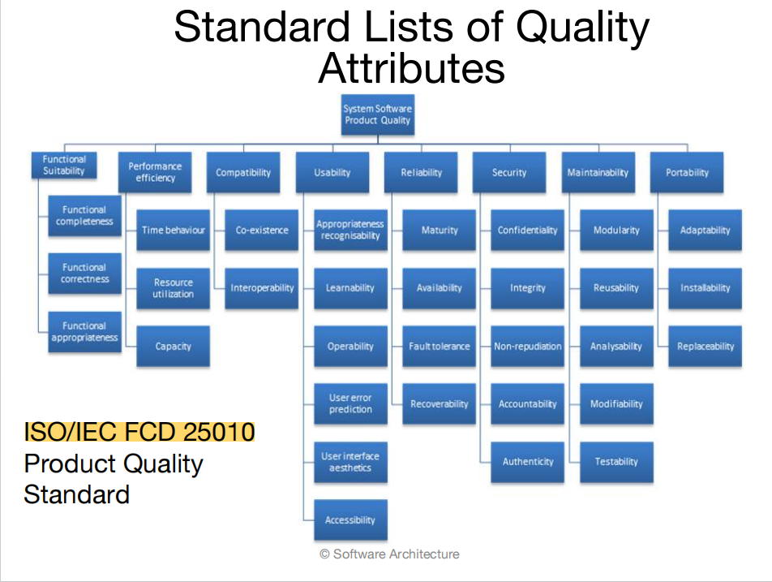
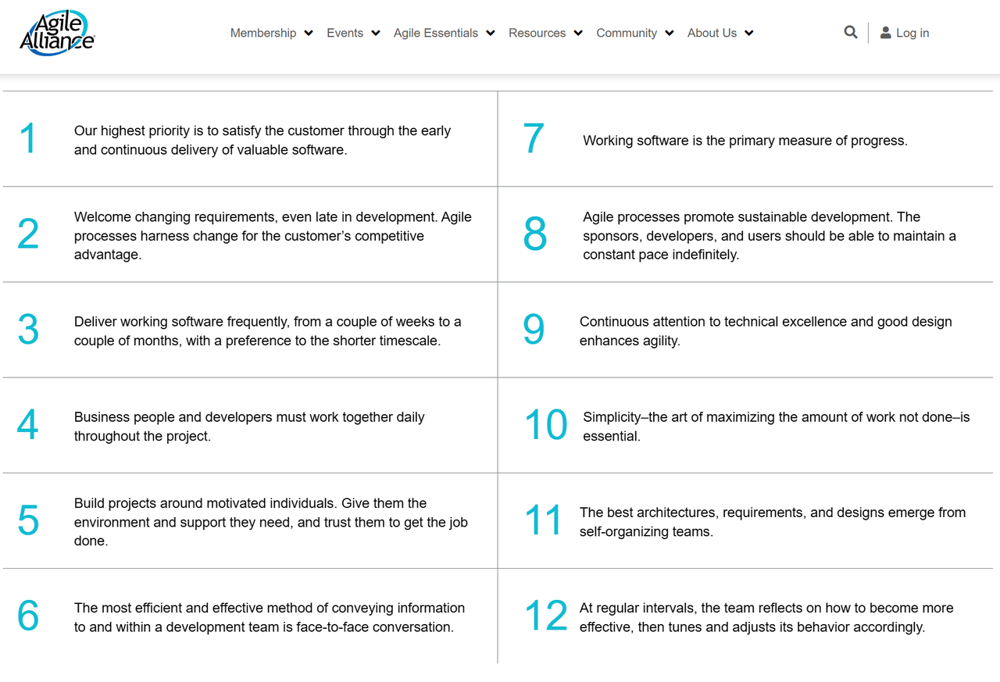
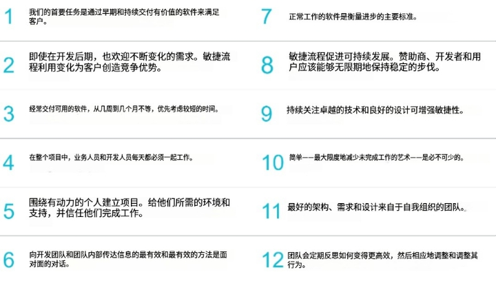
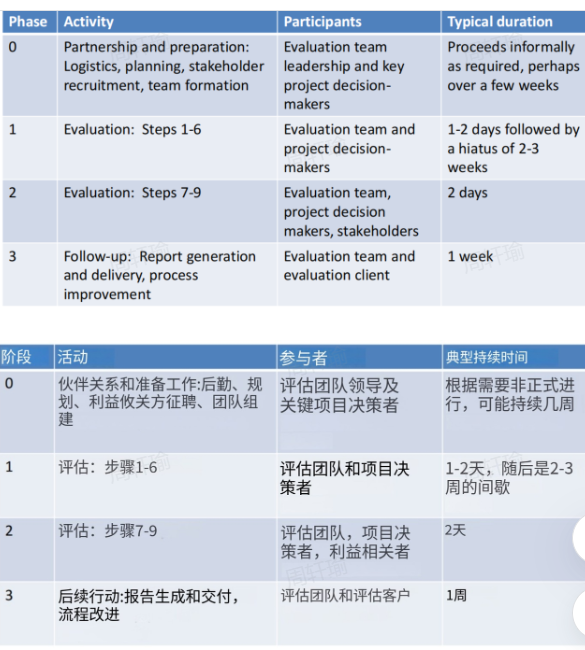

# Chapter 1. What is Software Architecture? 
## 理解：软件体系结构（软件架构）的定义、架构模式的概念。
### 软件体系结构（软件架构）的定义
- 定义：The software architecture of a system is the set of structuresneeded to reason for the system, which comprise software elements, relations among them, and properties of both. / 系统的软件架构是为系统进行推理所需的一组结构，包含软件元素、它们之间的关系以及两者的属性。
- 架构是一种“抽象”：An architecture specifically omits certain information about elements that is not useful for reasoning about the system. / 架构不是系统的全部细节。它是一种抽象，特意省略了那些对于“推理系统”没有帮助的细节信息。它让我们从元素排列、交互和组合的角度来看待系统，从而控制复杂性。
- 架构包含“行为”：架构不仅仅是静态的框图。元素的行为（即元素之间如何交互）也是架构定义的一部分，因为这些行为对于推理系统是必须的。
- 架构由“多组结构”组成：模块结构 (Module Structures): **静态**的代码/数据单元；组件与连接件结构 (Component-and-connector Structures): **运行时**的交互。分配结构 (Allocation Structures): 软件与外部环境（硬件、文件系统、团队）的映射。

### 架构模式（Architectural Patterns）的概念
- 定义：An architectural pattern presents the element types and their forms of interaction used in solving a particular problem.  /  架构模式是为了解决特定问题而呈现出的元素类型（Element types）及其交互形式（Forms of interaction）。

### 各类结构对应的常见模式 
#### 模块类型模式 (Module type pattern)
- 分层模式 (Layered Pattern):元素之间的“使用”关系（Uses relation）是严格单向的。每一层是一组相关功能的集合。
####  组件与连接件类型模式 (Component-and-connector type pattern)
- 共享数据模式 (Shared-data / Repository pattern):包含创建、存储和访问持久数据的组件。通常表现为数据库形式。
- 客户-服务器模式 (Client-server pattern):组件分为客户端和服务器，通过协议和消息进行交互。
- 对等模式 (Peer-to-peer pattern):Bittorrent, eMule. 
#### 分配类型模式 (Allocation type pattern)
- 多层模式 (Multi-tier pattern): 描述了如何将系统组件分布和分配到不同的硬件和软件子集中。
- 能力中心模式 (Competence center pattern):根据技术或领域专长将工作分配给不同的站点（Site）。
- 平台模式 (Platform pattern):一个站点开发可重用的核心资产（Core assets），其他站点开发使用这些资产的应用程序。

## 掌握：软件系统有哪几类结构？在每类结构里，元素及其之间的关系是什么？每类结构各有哪些常见的结构？其特点是什么？
### 模块结构 (Module Structures)
- 这类结构关注的是系统的静态实现。
- 元素 (Elements)： 模块（Modules），例如类（classes）、层（layers）或功能的划分。
- 关系 (Relations)： 取决于具体的子结构，通常是“是...的子模块”(is-a-submodule-of)、“依赖/使用”(uses)、“继承”(inherits from)。
#### 常见结构
- 分解结构 (Decomposition structure)： 递归地将模块分解为更小的模块，直到易于理解。关系是 is-a-submodule-of。很大程度上决定了系统的可修改性（modifiability），确保变更被局部化。
- 使用结构 (Uses structure)： 关系是 uses（一种特殊的依赖关系）。如果A的正确性取决于B的正确存在，则A使用了B。
- 层结构 (Layer structure)：每一层是一个提供内聚服务集的抽象“虚拟机”。层与层之间以严格管理的方式使用（通常是单向）。赋予系统可移植性（portability）。
- 类结构 (Class structure)：单元是类，关系是 inherits from (继承) 或 is an instance of (实例)。 支持代码**重用（reuse）**和功能的增量添加。
- 数据模型结构 (Data model structure)：描述数据实体（entities）及其属性和关系。
### 组件与连接件结构 (Component-and-connector Structures, C&C)
- 这类结构关注的是系统的运行时交互。
- 元素 (Elements)： 运行时组件（Runtime components），如服务、对等端（peers）、客户端、服务器。
- 关系 (Relations)： 连接件（Connectors），即组件之间的通信方式（如调用-返回、管道、同步操作符）。
#### 常见的结构及其特点
- 服务结构 (Service structure)： 单元是通过服务协调机制（如SOAP）进行互操作的服务。帮助工程化由匿名且独立开发的组件组成的系统。
- 并发结构 (Concurrency structure)：组件被安排在逻辑线程中。 确定**并行性（parallelism）**的机会以及资源争用可能发生的位置。
### 分配结构 (Allocation Structures)
- 这类结构关注的是软件与非软件环境的映射。
- 软件结构与外部环境（硬件、文件系统、团队）之间的映射关系。
- 元素 (Elements)： 软件元素 + 环境元素（处理器、文件/目录、团队）。
- 关系 (Relations)： allocated-to (分配给), assigned-to (指派给), migrates-to (迁移到)。
#### 常见结构
- 部署结构 (Deployment structure)：软件元素（通常是进程）分配给硬件处理和通信元素。关系是 allocated-to 或 migrates-to（如果是动态的）。 用于推理性能（performance）、可用性（availability）和安全性（security）。特别适用于分布式系统。
- 实现结构 (Implementation structure)：软件元素（模块）映射到开发、集成或配置环境中的文件结构（file structure）。
- 工作分配结构 (Work assignment structure)： 将模块的实现和集成责任分配给具体的团队（teams）。

## 了解：结构与视图是什么关系？好的结构的一些经验法则。
### Structure vs View
- 结构 (Structure) 是系统本身存在的本质，是由元素和它们之间的关系组成的集合。
- 视图 (View) 是结构的表现形式（Representation）。它是为了让人们理解和交流架构而创建的文档或图表。
- 核心关系： 一个视图是对一个或多个结构的呈现。
### 好的架构的“经验法则” (Rules of Thumb)
####  结构上的经验法则 (Structural "Rules of Thumb")
- 定义良好的模块
- 避免依赖特定工具版本
- 分离数据的生产与消费
- 模块与组件不是一一对应的
- 灵活的进程分配
- 有限的交互方式
#### 过程上的经验法则 (Process "Rules of Thumb")
- 单一负责人
- 基于质量属性
- 使用视图文档化
- 进行评估
- 支持增量实现

# Chapter 2. Why is Software Architecture Important?
## 理解：13个理由。
- Inhibiting or Enabling a System's Quality Attributes 决定了系统的质量属性：系统是否能够展现其期望（或要求的）质量属性在很大程度上取决于其架构。
- Predicting System Qualities / 预测系统的质量：
- Enhancing Communication Among Stakeholders / 增强利益相关者之间的沟通：架构具有足够的抽象性，足以让大多数非技术利益相关者理解。
- Earliest Design Decisions / 最早的设计决策
- Defining Constraints on an Implementation / 定义对实现的约束： 如果实现遵循架构所规定的设计决策，则该实现体现了架构。
- Influencing the Organizational Structure / 影响组织结构:架构规定了正在开发的系统的结构。
- Enabling Evolutionary Prototyping / 启用演化原型开发：一旦架构被定义，它就可以作为骨架系统进行原型开发。
- Improving Cost and Schedule Estimates / 改进成本和进度估算
- Transferable, Reusable Model / 可转移、可重用的模型：架构的重用为具有相似需求的系统提供了巨大的好处。
- Using Independently Developed Components / 使用独立开发的组件：
- Restricting Design Vocabulary / 限制设计词汇：架构限制了可用的元素和交互方式，从而简化设计。
- 培训的基础 (Basis for Training)：架构是新成员了解系统的第一步。

# Chapter 4. Understanding Quality Attributes
## 了解：系统的功能需求。功能需求与系统架构的关系。功能需求与质量需求的关系。系统约束。
### 系统的功能需求 (System Functional Requirements)
功能需求定义了系统必须做什么。它描述了系统在运行时如何表现或对外部刺激做出反应。本质上，它是系统完成预期工作的能力。
###  功能需求与系统架构的关系 (Relationship between Functionality and Architecture)
- 功能性与架构之间存在一种“奇怪”的关系：功能性并不决定架构。
- 也就是说，给定一组功能需求，可能有多种不同的架构都能满足它。
- 在架构设计中，功能需求是通过在设计中包含适当的**“职责集合（set of responsibilities）”**来满足的。
### 功能需求与质量需求的关系 (Relationship between Functionality and Quality Attributes)
- 质量属性需求是对功能需求的**“限定”或“修饰”（Qualify）**。
- 功能需求陈述“做什么”，而质量属性陈述“做得怎么样”（例如：做得多快、多可靠、多安全）。
### 系统约束 (System Constraints)
约束被定义为**“自由度为零（zero degrees of freedom）”的设计决策**。
## 理解：系统的质量需求。战术的概念。
### 系统的质量需求
#### 分类
- 运行时属性 (Runtime properties)： 描述系统运行时的特性，如可用性、性能、易用性、安全性。(APUS)
- 开发期属性 (Development properties)： 描述系统开发过程中的特性，如可修改性、可测试性。（MT）
#### 传统描述的问题与解决方案
以前对质量属性的定义往往存在**“不可测试 (Untestable)”（例如只说系统要“易于修改”是无意义的）和“关注点重叠 (Overlapping)”的问题。
解决方案是使用质量属性场景 (Quality Attribute Scenarios)** 来具体化这些需求。
#### 质量属性场景的六要素 (关键考点)
质量属性场景是一种刻画质量属性的方法。它将模糊的质量需求（如“系统要快”）转化为具体、可测试的描述。
- 刺激源 (Source of stimulus)： 谁产生了刺激（人、计算机等）。
- 刺激 (Stimulus)： 到达系统的条件（需要响应）。
- 制品 (Artifact)： 被刺激的系统部分（整个系统或某个模块）。
- 环境 (Environment)： 刺激发生时的条件（如正常运行、过载）。
- 响应 (Response)： 系统采取的行动。
- 响应度量 (Response measure)： 对响应的可测试度量（如延迟时间、吞吐量）。
#### 质量需求的实现方式
功能需求是通过分配“职责”来满足的，而质量属性需求是通过架构的**“结构和行为 (structures and behaviors)”**来满足的。

### 战术的概念
战术是架构师用来实现单一质量属性响应的设计决策。它是架构设计的原语 (primitives)。战术不是被发明的，而是从架构师的实践中总结（capture）出来的。
-  战术 vs. 架构模式 (Tactics vs. Architectural Patterns)：战术：只关注单一质量属性，不考虑权衡 (tradeoffs)；架构模式：可以看作是战术的**“打包 (packages)”，并且考虑了权衡**
### 为什么要使用战术？
- 灵活
- 第一性原理： 如果没有现成的模式能满足目标，战术允许架构师从“基本原理”构建设计片段。
- 成本选择： 通过分类战术，架构师可以在多种改进质量的方法中，根据实施成本进行选择。

## 掌握：质量属性场景的概念和举例。质量设计的7种决策。
### 质量设计的7种决策
- 职责分配 (Allocation of Responsibilities)： 识别基本系统功能、基础设施和质量属性的职责，并决定将它们分配给哪些模块、组件或连接件。
- 协调模型 (Coordination Model)： 决定哪些元素需要交互（或禁止交互），交互的属性（如及时性、一致性），以及选择通信机制（如同步/异步、有状态/无状态）。
- 数据模型 (Data Model)：选择主要的数据抽象、元数据以及数据的组织方式（如关系数据库 vs 对象集合）。
- 资源管理 (Management of Resources)：识别需要管理的资源及其限制，决定哪个元素管理资源，以及资源争用时的共享策略。
- 架构元素间的映射 (Mapping Among Architectural Elements)：模块与运行时元素的映射、运行时元素与处理器的映射（部署）、数据模型与存储的映射等。
- 绑定时间决策 (Binding Time Decisions)： 决定上述决策是在何时被“固定”下来的（构建时 build-time vs 运行时 run-time）。例如，是在编译时确定协议，还是运行时协商。
- 技术选择 (Choice of Technology)：决定使用哪些可用技术来实现上述决策，评估工具支持、团队熟悉度以及技术的副作用。

# Chapter 5. Availability
## 理解：可用性概念。
**总结：**
可用性是指系统在需要时能够处于准备好并执行任务的状态的属性。它关注的是如何最大限度地减少服务中断时间。
*   **核心定义**：系统屏蔽（mask）或修复（repair）故障的能力，使得累计的服务中断时间不超过规定值。
*   **故障与失效的区别 (Fault vs. Failure)**（Page 53）：
    *   **失效 (Failure)**：系统不再提供符合规格说明的服务（对用户可见）。
    *   **故障 (Fault)**：可能导致失效的潜在原因（内部错误）。
    *   **目标**：可用性战术的目标是防止故障（Fault）演变成失效（Failure）。
## 了解：可用性公式。可用性一般场景。
- **定义方式**：在特定时间间隔内，累计服务中断时间不超过要求的值。$MTBF / (MTBF+MTTR)$
- 场景：刺激 (Stimulus)：故障（Fault），如遗漏、崩溃、时间错误、响应错误。响应 (Response)：防止故障变成失效；检测故障（记录、通知）；从故障中恢复（禁用源、修复、降级运行）。响应度量 (Response Measure)：可用性百分比、检测时间、修复时间、降级模式运行时间。
## 掌握：可用性战术。可用性设计清单。
### 可用性战术
#### 检测故障 (Detect Faults)
- Ping/Echo：用于确定可达性和往返延迟（由检测者发起）。
- 心跳 (Heartbeat)：被监控进程定期向监控器发送消息（由被监控者发起）。
- 异常检测 (Exception Detection)
- 时间戳 (Timestamp)：用于检测分布式系统中不正确的事件序列。
- 条件监控 (Condition Monitoring)：检查进程或设备中的条件（如校验和 Checksum）。
- 表决 (Voting)：通常实现为三模冗余（TMR），通过多数派机制屏蔽故障。
#### 从故障中恢复 (Recover from Faults)
- 冗余策略 (Redundancy Tactics):
 - 主动冗余/热备 (Active Redundancy / hot spare)：所有节点并行处理相同的输入，状态同步。故障切换极快（毫秒级）。
 - 被动冗余/温备 (Passive Redundancy / warm spare)：只有主节点处理流量，定期向备节点发送状态更新。
 - 冷备 (Spare / cold spare)：备用节点在故障发生前处于未服务状态（甚至未启动），需要启动和初始化过程。
- 回滚 (Rollback)：恢复到之前的已知良好状态（检查点 Checkpoint）。
- 重试 (Retry)：针对瞬时故障（如网络抖动）。
- 忽略故障行为 (Ignore Faulty Behavior)：如忽略DoS攻击的虚假消息。
- 降级 (Degradation)：保留关键功能，丢弃非关键功能。
- 重配置 (Reconfiguration)：重新分配职责给剩余的资源。
#### 预防故障 (Prevent Faults)
- 从服务中移除 (Removal From Service)：暂时将组件置于服务外以减轻潜在故障（如重启防内存泄漏）。
- 事务 (Transactions)：确保原子性、一致性、隔离性、持久性（ACID）。
- 预测模型 (Predictive Model)：检测预示故障的条件并采取纠正措施。
- 增加能力集 (Increase Competence Set)：设计组件以处理更多的异常情况。

# Chapter 6. Interoperability
## 理解：互操作性概念。
**总结：**
互操作性是指两个或多个系统在特定上下文中，通过接口有用地交换有意义信息的能力。
*   **核心定义**：重点在于“交换（exchange）”和“有意义（meaningful）”。
*   **两个层面**（Page 3）：
    1.  **语法互操作性 (Syntactic interoperability)**：交换数据的能力（能传数据）。
    2.  **语义互操作性 (Semantic interoperability)**：解释被交换数据的能力（能读懂数据）。
*   **两种视角**（Page 4）：
    1.  **已知外部接口**：将这些知识设计进系统中。
    2.  **未知外部系统**：以更通用的方式设计系统以进行互操作。
## 了解：互操作性一般场景。
*   **刺激 (Stimulus)**：在一组系统之间交换信息的请求。
*   **环境 (Environment)**：希望互操作的系统是在运行时发现的（discovered at run time）还是在运行前就知道的。
*   **响应 (Response)**：接受请求并交换信息，或者拒绝并通知，或者记录请求。
*   **响应度量 (Response Measure)**：正确处理的信息交换百分比，或拒绝的百分比。
## 掌握：互操作性战术。互操作性设计清单。
### 互操作性战术 (Interoperability Tactics)
#### A. 定位 (Locate)
为了交换信息，系统必须先知道彼此。这就是定位战术的目的。
*   **服务发现 (Service Discovery)**：通过搜索定位服务。机制包括 UDDI, Jini, UPnP 等 (Page 12)。
*   **搜索方法 (Searching Methods)**：
    1.  **搜索者发起 (Searcher’s initiative)**：
        *   **广播请求 (Flood/Broadcast)**：询问每个实体。对搜索者效率高，但对环境干扰大 (Page 14)。
        *   **连续请求 (Successive request)**：逐个询问。对搜索者效率低，但对环境干扰小 (Page 15)。
    2.  **被搜索者发起 (Searched’s initiative)**：
        *   **持续广告 (Continuous/periodical advertisement)**：搜索者容易发现，但被搜索者资源消耗大 (Page 16)。
        *   **到达时广告 (Advertisement upon arrival)**：例如新用户进入大厅时介绍自己 (Page 17)。
    3.  **注册 (Registration)**：
        *   引入“中间人（middlemen/registry）”。被搜索者注册，搜索者查询注册中心。
        *   **优点**：资源消耗低。**缺点**：注册中心必须可用且可靠 (Page 18-19)。
#### B. 管理接口 (Manage Interfaces)
即“在语义上有意义地交换信息”。
*   **编排 (Orchestrate)**：使用控制机制来协调、管理和排序服务的调用。当系统必须以复杂方式交互以完成复杂任务时使用。
    *   *PPT依据 (Page 25):* "uses a control mechanism to coordinate, manage and sequence the invocation of services."
*   **定制接口 (Tailor Interface)**：在接口中添加或删除功能，例如转换（translation）、缓冲（buffering）或数据平滑（data-smoothing）。这通常用于解决数据格式或通信速率不匹配的问题。

# Chapter 7. Modifiability
## 理解：可修改性概念。
**总结：**
可修改性是关于变革（change）的属性，我们关注的核心在于进行变革的**成本（cost）**和**风险（risk）**。

*   **四个关键问题**：为了规划可修改性，架构师必须考虑：
    1.  **什么**会改变？（功能、平台、环境、容量等）
    2.  改变的**可能性**有多大？
    3.  **何时**改变以及**谁**来改变？（开发时/构建时/运行时；开发者/用户/管理员）
    4.  改变的**成本**是多少？

*   **成本的两个方面** (Page 31)：
    1.  引入机制以提高系统可修改性的成本（前期投资）。
    2.  使用该机制进行修改的成本（后期维护）。
## 了解：可修改性一般场景。
*   **刺激 (Stimulus)**：一个指令，要求添加/删除/修改功能，或改变质量属性、容量、技术。
*   **刺激源 (Source)**：最终用户、开发人员、系统管理员。
*   **制品 (Artifacts)**：代码、数据、接口、组件、资源、配置等。
*   **环境 (Environment)**：运行时、编译时、构建时、设计时等。
*   **响应 (Response)**：进行修改、测试修改、部署修改。
*   **响应度量 (Response Measure)**：**成本**（以受影响制品的数量/大小/复杂度、精力、日历时间、金钱来衡量）。
## 掌握：可修改性战术。可修改性设计清单。
### 可修改性战术 (Modifiability Tactics)
#### A. 减少模块大小 (Reduce Size of a Module)
*   **拆分模块 (Split Module)**：如果被修改的模块包含太多功能，修改成本会很高。将其细分为更小的模块可以降低未来变更的平均成本。
#### B. 增加内聚 (Increase Cohesion)
*   **增加语义一致性 (Increase Semantic Coherence)**：如果一个模块中的职责A和B服务的目的不同，它们应该被放入不同的模块中。这涉及创建新模块或移动职责。
#### C. 减少耦合 (Reduce Coupling)
耦合是模块间责任重叠的度量。高耦合是可修改性的敌人。
*   **封装 (Encapsulate)**：引入显式接口。接口包含API及其相关职责，隐藏内部细节。
*   **使用中介 (Use an Intermediary)**：打破直接依赖（如A依赖B）。例如 **Publish/Subscribe 系统**
*   **限制依赖 (Restrict Dependencies)**：限制一个模块可以与哪些模块交互（例如：层级结构中只允许查看下层模块）。
*   **提取公共服务 (Abstract Common Services)**：如果两个模块提供类似但不完全相同的服务，将它们抽象为一种通用的形式并实现一次（如公共库）。
#### D. 推迟绑定 (Defer Binding)
*   **概念**：一般来说，绑定值的时间越晚（如运行时绑定），灵活性越好。虽然引入机制有成本，但使用机制进行修改通常比手动修改代码便宜。

# Chapter 8. Performance
## 理解：性能概念
**总结：**
性能是关于**时间（Time）**的属性。它描述了软件系统满足时序要求的能力。
*   **核心**：当事件发生时，系统必须在规定时间内做出响应。
*   **响应时间的组成** (Page 64)：
    1.  **处理时间 (Processing time)**：系统进行计算/工作以产生响应的时间。
    2.  **阻塞时间 (Blocked time)**：系统无法响应的时间（例如等待资源）。
        *   阻塞的原因包括：资源争用（Contention）、资源可用性（Availability）、依赖其他计算（Dependency）。
## 了解：性能公式。性能一般场景。
### 性能公式
*   **最早开始时间 (EST)**：取决于处理器的可用时间以及该任务所有前驱任务完成并传输数据过来的时间。
    *   $EST(n_i, p_j) = \max \{ avail[j], \max (AFT(n_m) + c_{m,i}) \}$
*   **最早结束时间 (EFT)**：开始时间 + 执行时间。
    *   $EFT(n_i, p_j) = w_{i,j} + EST(n_i, p_j)$
*   **实际完成时间 (AFT)**：选择使结束时间最早的那个处理器。
    *   $AFT(n_i) = \min EFT(n_i, p_j)$

PPT有一个计算甘特图图的问题
### 性能一般场景
*   **刺激 (Stimulus)**：周期性、偶发性或随机性事件的到达。
*   **响应 (Response)**：处理事件，或改变服务级别。
*   **响应度量 (Response Measure)**：潜伏期（Latency）、最后期限（Deadline）、吞吐量（Throughput）、抖动（Jitter）、丢失率（Miss rate）。
## 掌握：性能战术。性能设计清单。
### 性能战术 (Performance Tactics)
#### A. 控制资源需求 (Control Resource Demand)
目标是减少对资源的需求量（在需求侧操作）。
*   **管理采样率 (Manage Sampling Rate)**：降低数据流捕获的频率。
*   **排列事件优先级 (Prioritize Events)**：根据重要性对事件排序，资源不足时忽略低优先级事件。
*   **减少开销 (Reduce Overhead)**：移除中间件或中介，减少处理事件流消耗的资源。
*   **限制执行时间 (Bound Execution Times)**：限制用于响应事件的执行时间（如限制迭代次数）。
*   **提高资源效率 (Increase Resource Efficiency)**：改进关键区域的算法。
#### B. 管理资源 (Manage Resources)
目标是让手头的资源更有效地处理需求（在响应侧操作）。
*   **增加资源 (Increase Resources)**：更快的CPU、更多内存、更快的网络。
*   **引入并发 (Increase Concurrency/Introduce Concurrency)**：并行处理请求以减少阻塞时间。
*   **维护计算的多个副本 (Maintain Multiple Copies of Computations)**：使用副本和负载均衡器来减少单服务器的争用。
*   **维护数据的多个副本 (Maintain Multiple Copies of Data)**：
    *   **数据缓存 (Data caching)**：保留不同访问速度的副本（如内存 vs 磁盘）。
    *   **数据复制 (Data replication)**：保留分离的副本以减少并发访问争用。
*   **资源调度 (Scheduling)**：当资源有争用时，必须进行调度。
    *   PPT Page 74-93 详细展开了调度问题，包括任务模型（DAG, 周期任务）、资源模型、目标（最小化完成时间）以及具体的调度算法（如 List Scheduling）。

# Chapter 9. Security
## 理解：安全性概念
**总结：**
安全性是衡量系统保护数据和信息免受未授权访问，同时仍为授权人员和系统提供访问的能力。
*   **攻击 (Attack)**：针对计算机系统采取的意图造成伤害的行为。
*   **CIA 三要素** (Page 3)：
    1.  **机密性 (Confidentiality)**：数据或服务受到保护，免受未授权访问（如黑客无法查看纳税申报表）。
    2.  **完整性 (Integrity)**：数据或服务不被未授权地篡改（如成绩未被篡改）。
    3.  **可用性 (Availability)**：系统可供合法使用（如防止DoS攻击）。
*   **支持 CIA 的特性** (Page 4)：
    1.  **认证 (Authentication)**：验证交易方身份，确保他们是其声称的人。
    2.  **授权 (Authorization)**：授予用户执行任务的权限（特权）。

## 了解：安全一般场景
*   **刺激 (Stimulus)**：未经授权的尝试（显示数据、更改/删除数据、访问服务、降低可用性）。
*   **刺激源 (Source)**：人或系统（已知/未知，内部/外部）。
*   **制品 (Artifact)**：系统服务、数据、组件、资源。
*   **环境 (Environment)**：在线/离线，联网/断网，防火墙后/开放，正常/部分运行。
*   **响应 (Response)**：保护数据/服务；记录访问/修改；记录尝试；通知实体。
*   **响应度量 (Response Measure)**：系统被破坏的程度、检测攻击所需时间、抵抗攻击的数量、恢复时间、暴露的数据量。
## 掌握：安全性战术。安全性设计清单。
### 安全性战术 (Security Tactics)
#### A. 检测攻击 (Detect Attacks)
*   **入侵检测 (Detect Intrusion)**：将网络流量或请求模式与已知的恶意行为特征库（signatures）进行比较。
*   **服务拒绝检测 (Detect Service Denial)**：将进入的网络流量模式与已知的DoS攻击历史概况进行比较。
*   **验证消息完整性 (Verify Message Integrity)**：使用校验和（checksums）或哈希值（hash values）来验证消息、文件或配置的完整性。
*   **检测消息延迟 (Detect Message Delay)**：检查消息传递时间，以检测可疑的时序行为（如中间人攻击）。
#### B. 抵御攻击 (Resist Attacks)
*   **识别参与者 (Identify Actors)**：识别任何外部输入的来源。
*   **认证参与者 (Authenticate Actors)**：确保用户或远程计算机确实是其声称的身份。
*   **授权参与者 (Authorize Actors)**：确保已认证的参与者有权访问和修改数据或服务。
*   **限制访问 (Limit Access)**：限制对资源（内存、网络连接、接入点）的访问。
*   **限制暴露 (Limit Exposure)**：通过拥有最少数量的接入点来最小化攻击面（例如防火墙、关闭端口）。
*   **加密数据 (Encrypt Data)**：对数据和通信应用加密。
*   **分离实体 (Separate Entities)**：物理分离服务器或使用虚拟机。
*   **更改默认设置 (Change Default Settings)**：强制用户更改默认分配的设置。
#### C. 应对攻击 (React to Attacks)
*   **撤销访问 (Revoke Access)**：如果怀疑有攻击，限制对敏感资源的访问（即使是合法用户）。
*   **锁定计算机 (Lock Computer)**：如果多次尝试访问失败，则锁定资源访问。
*   **通知参与者 (Inform Actors)**：当怀疑或检测到攻击时，通知操作员或其他系统。
#### D. 从攻击中恢复 (Recover from Attacks)

# Chapter 10. Testability
## 理解：可测试性概念
- 可测试性不仅仅是“能测试”，它在软件体系结构中有着精确的定义，核心在于发现故障的难易程度。
- 可测试性是指它在下一次测试执行中失败的概率
- 核心目标：如果系统中存在故障，我们希望它在测试期间尽可能快地失败
- 一个具有可测试性的系统，必须能够控制每个组件的输入，并能观察其输出（以及可能的内部状态）。
## 了解：可测试性一般场景
- Source (源): Unit testers, integration testers, system testers... (各种测试人员或自动测试工具)。
- Stimulus (刺激): A set of tests are executed due to the completion of a coding increment, implementation, or delivery. (由于编码完成、实现或交付而执行的一组测试)。
- Artifact (制品): The portion of the system being tested. (被测试的系统部分)。
- Response (响应): Execute tests and capture results; capture activity that resulted in the fault; control and monitor the state of the system. (执行测试并捕获结果；捕获导致故障的活动；控制并监控系统状态)。
- 响应测量 (Response Measure) ：发现故障的工作量；达到特定状态空间覆盖率的工作量；下次测试发现故障的概率；执行测试的时间；准备测试环境的时间
## 掌握：可测试性战术。可测试性设计清单。
### 可测试性战术
可测试性战术的目标是在软件开发的增量完成后，使测试变得更加容易。
#### 控制和观察系统状态 (Control and Observe System State)
- Specialized Interfaces (专门接口) ：获取变量的值
- Record/Playback (记录/回放)：捕获跨越接口的信息，并将其用作进一步测试的输入
- Localize State Storage (定位状态存储) ：为了在任意状态下开始测试，如果该状态存储在单一位置会最方便。
- Sandbox 沙箱： 将系统与现实世界隔离，以便进行实验。
- Executable Assertions (可执行断言)：断言是手工编写并放置在特定位置，用以指示程序何时何地处于故障状态
#### 限制复杂度 (Limit Complexity)
- Limit Structural Complexity (限制结构复杂度)：避免或解决组件间的循环依赖，并减少组件间的依赖。
 - limit the depth of inheritance tree (限制继承树深度)；
 - High cohesion, and loose coupling (高内聚、松耦合)。
- Limit Non-determinism (限制非确定性)：寻找所有非确定性来源，如无约束的并行，并尽可能剔除它们。

# Chapter 11. Usability
## 理解：易用性概念。
- 可用性关注的是用户完成期望任务的难易程度以及系统提供的用户体验支持。
- 可用性是提高系统质量最经济、最简单的方法之一。
-    **涵盖领域 (PPT Page 38)：**
    易用性包括以下五个方面：
    1.  "Using a system **efficiently**." (高效使用)
    2.  "**Learning** system features." (学习系统功能)
    3.  "**Minimizing the impact of errors**." (将错误影响降至最低)
    4.  "Adapting the system to **user needs**." (使系统适应用户需求)
    5.  "Increasing **confidence and satisfaction**." (增加信心和满意度)
## 了解：易用性一般场景。
- 
    *   **Source (源):** End user (终端用户)。
    *   **Stimulus (刺激):** End user tries to **use a system efficiently, learn to use the system, minimize the impact of errors, adapt the system, or configure the system**. (用户尝试高效使用、学习使用、减少错误影响、适配或配置系统)。
    *   **Artifact (制品):** System or the specific portion of the system... (系统或用户交互的特定部分)。
    *   **Response (响应):** "The system should either **provide the user with the features needed or anticipate the user’s needs**." (系统应提供所需功能或预判用户需求)。
    *   **响应测量 (Response Measure):** 任务时间；错误数量；完成的任务数；用户满意度；用户知识的获取；成功操作比例；出错时损失的时间或数据量。
## 掌握：易用性战术。易用性设计清单。
### 易用性战术 (Usability Tactics)
#### 支持用户主动性 (Support User Initiative)
- Cancel(取消)：系统必须监听取消请求；被取消的命令必须终止；使用的资源必须释放；并且必须通知协作组件。
- Pause/Resume (暂停/恢复):暂时释放资源以便重新分配；用于长时运行的操作。
- Restore (恢复/撤销) :维护足够的系统状态信息，以便恢复到之前的状态。
- Aggregate (聚合):将低级对象聚合成组，以便对组进行统一操作，减少重复劳动。
#### 支持系统主动性 (Support System Initiative)
- Maintain Task Model (维护任务模型) :确定上下文，使系统了解用户尝试的操作并提供帮助。
- Maintain System Model (维护系统模型) :系统维护自身的显式模型，用以确定预期行为，从而向用户提供适当的反馈。
- Maintain User Model (维护用户模型) 

 
# Chapter 12. Other Quality Attributes
## 了解：其它软件质量属性如可变性、可移植性、开发可分布性、伸缩性、可部署性、移动性、可监控性、生命财产安全性。其它类别的质量属性如架构质量属性、商业属性、系统质量属性。ISO/IEC FCD 25010 产品质量标准。
### 第一部分：了解其它软件质量属性

这些属性在特定的应用场景（如分布式开发、移动端应用、云服务）中至关重要。

#### 1. Portability (可移植性) (PPT Page 47)
*   **原话引用：**
    > "Portability refers to the **ease** with which software that built to run on one platform can be **changed to run on a different platform**."
    > （可移植性是指将为某一平台构建的软件更改为在另一平台上运行的**难易程度**。）
*   **归类：** 它被视为 "a special form of **modifiability**"（可修改性的一种特殊形式）。

#### 2. Development Distributability (开发可分布性) (PPT Page 48)
*   **原话引用：**
    > "Development Distributability is the quality of designing the software to **support distributed software development**."
    > （开发可分布性是支持分布式软件开发的软件设计质量。）
*   **核心目的：** 
    > "The purpose is to **minimize the coordination** among the teams."
    > （其目的是**最小化团队间的协调**，通常用于全球分布式团队。）

#### 3. Scalability (伸缩性) (PPT Page 49)
伸缩性分为两个重要维度，这是常考点：
*   **Horizontal scalability (水平伸缩/向外扩展):** 
    > "adding more resources to **logical units** such as adding another server to a cluster." （向逻辑单元添加更多资源，如向集群添加服务器。）
*   **Vertical scalability (垂直伸缩/向上扩展):** 
    > "adding more resources to a **physical unit** such as adding more memory to a computer." （向物理单元添加更多资源，如增加内存。）
*   **效果：** 产生可衡量的改进且不中断操作。

#### 4. Deployability (可部署性) (PPT Page 50)
*   **原话引用：**
    > "Deployability is concerned with **how an executable arrives at a host platform and how it is invoked**."
    > （可部署性关注可执行文件如何到达主机平台以及如何被调用。）
*   **例子：** Javascripts, Virus, Agent。

#### 5. Mobility (移动性) (PPT Page 51)
*   **原话引用：**
    > "Mobility deals with the problems of **movement and affordances** of a platform."
    > （移动性处理平台的移动和示能性（环境提供的行为可能性）问题。）
*   **关键议题：** 电池管理 (Battery management)、断开与重连 (Disconnection and reconnection)、蜂窝网络切换 (Hand-off)。

#### 6. Monitorability (可监控性) (PPT Page 52)
*   **原话引用：**
    > "Monitorability deals with the ability of the **operations staff to monitor the system while it is executing**."
    > （可监控性涉及操作人员在系统运行时对其进行监控的能力。）
*   **监控指标：** 组件健康状况 (health)、平均事务处理时间、队列长度。

#### 7. Safety (生命财产安全性) (PPT Page 53)
*   **原话引用：**
    > "Software safety is about the software’s ability to **avoid entering states that cause or lead to damage, injury, or loss of life** and to recover and limit the damage when it does enter into bad states."
    > （软件安全性是指软件避免进入导致损失、伤害或生命损失的状态的能力，以及进入坏状态时的恢复和限制损失能力。）
*   **关系：** 它的架构关注点与 **availability（可用性）** 几乎完全相同。

## 理解：如何处理未知的质量属性。
1.  **使用标准列表 (Standard Lists):** 当面对模糊或未知的质量需求时，参考 **ISO/IEC 25010** 等标准列表（PPT Page 54），将未知的需求映射到已知的分类中。
2.  **映射到已知属性:** 许多“新”属性本质上是核心属性的变体。例如：
    *   **Portability** 映射到 **Modifiability** (PPT Page 47)。
    *   **Safety** 映射到 **Availability** (PPT Page 53)。
3.  **使用一般场景 (General Scenarios):** 无论属性多么新颖，都可以通过“源、刺激、制品、环境、响应、测量”这六要素来定义它，使其变得可具体化、可衡量。

# Chapter 13. Patterns and Tactics
## 了解：架构模式（架构风格）的概念
- An architecture pattern is a package of design decisions that is found repeatedly in practice.  /   架构模式是在实践中反复发现的一组设计决策包。
- 具有允许重用的已知属性，并描述一类体系结构
*   **分类 (PPT Page 3)：**
    1.  **Module patterns** (模块模式)：如 Layered pattern。
    2.  **Component-and-Connector patterns** (组件与连接器模式)：如 Broker, MVC, Pipe-and-Filter, C/S, P2P, SOA, Pub/Sub, Shared-Data。
    3.  **Allocation patterns** (分配模式)：如 Map-Reduce, Multi-tier。
## 掌握：层次模式、代理模式、MVC模式、管道-过滤器模式、CS模式、P2P模式、SOA模式、发布订阅模式、共享数据模式、Map-Reduce模式、多级模式。
#### 1. Layered Pattern (层次模式)
*   **问题：**  最小化不同开发组织之间的交互，并支持可移植性、可修改性和重用性。
*   **方案：** 分层的模式把软件分成了层级单元,每一层都是一组模块，提供一组内聚的服务,每一层都通过一个公用的接口暴露出来
*   **约束：** "The **allowed-to-use** relations should **not be circular**." (不允许循环使用关系)
*   **弱点：** 添加层会增加系统的成本和复杂性,性能下降

#### 2. Broker Pattern (代理模式) 
*   **问题：** 我们如何构建分布式软件，使得服务用户不需要知道服务提供者的性质和位置？
*   **方案：** 经纪人模式通过插入一个名为经纪人的中介来将客户端与提供服务器分开。
- **元素Elements**
 - Client, a requester of services / 客户端：服务的请求者。
 - Server, a provider of services / 服务器：服务的提供者。
 - Broker,  / 经纪人：中介，定位合适的服务器以满足客户端的请求，将请求转发给服务器，并将结果返回给客户端。
- 约束：客户端只能连接到经纪人。服务器也只能连接到经纪人。
*   **弱点：** 经纪人在客户端和服务器之间增加了延迟，并且可能是通信瓶颈；单点故障；经纪人可能是安全攻击的目标。

#### 3. Model-View-Controller Pattern (MVC 模式) 
*   **问题：** 如何将用户界面功能与应用程序功能分开，同时仍然能够响应用户输入，或底层应用程序数据的变化？以及如何在底层应用程序数据变化时创建、维护和协调用户界面的多个视图？
*   **方案：** 将组件分为三类：**Model** (包含数据)、**View** (显示数据并与用户交互)、**Controller** (协调二者并管理状态变化通知)。
- Constraints:  MVC 必须各自得至少有一个实例
*   **弱点：** 对于简单的用户接口，这种复杂度也许并不值得使用

#### 4. Pipe and Filter Pattern (管道-过滤器模式)
*   **问题：** 如何加快数据处理速度？
*   **方案：** 数据到达过滤器的输入端口，被转换后，然后通过其输出端口通过管道传递给下一个过滤器。
- 元素
 - 过滤器，这是一个组件，它将其输入端口读取的数据转换为写在其输出端口的数据
 - 管道，这是一个连接器，它将数据从一个过滤器的输出端口传递到另一个过滤器的输入端口
*   **约束：** "连接的过滤器必须就沿连接管道传递的数据类型达成一致。

#### 5. Client-Server Pattern (CS 模式) 
*   **问题：** 存在大量分布式客户端想要访问的**共享资源和服务**，且需要**控制访问或服务质量**。
*   **方案：** 通过集中控制这些资源和服务来提高可用性。客户端通过请求服务器的服务进行交互。
*   **弱点：** 单点故障，服务器可能成为性能瓶颈。在客户端或服务器中定位功能的决定通常是复杂的，并且在系统建成后更改成本很高。

#### 6. Peer-to-Peer Pattern (P2P 模式) (PPT Page 21-22)
*   **问题：** 一组“对等”的分布式计算实体如何组织并分享服务，具有高可用性和可扩展性？
*   **方案：** 在点对点（P2P）模式中，组件直接作为对等体进行交互。所有对等体都是“平等”的。
*   **弱点：** 维护数据（一致性，备份）；小型P2P系统可能无法实现性能和可用性等质量目标；大型P2P网络可能会遭受响应时间变慢和延迟增加的影响，影响整体用户体验。

#### 7. Service Oriented Architecture Pattern (SOA 模式) 
*   **问题：** 我们如何支持在不同平台上运行、使用不同实现语言编写、由不同组织提供、并分布在互联网上的分布式组件之间的互操作性？
- 解决方案：面向服务的架构（SOA）模式描述了一系列提供和/或消费服务的分布式组件。
*   **核心元素：** 
 - 服务提供者，通过发布的接口提供一项或多项服务。
 - 服务消费者，直接或通过中介调用服务。
 - **ESB** (企业服务总线)：这是一个中介元素，可以在服务提供者和消费者之间路由和转换消息。
 - **Registry of services** (服务注册表)：提供者可以用它来注册服务，消费者可以用它在运行时发现服务。
 - **SOAP/REST** 连接器。
  - SOAP连接器，使用SOAP协议进行Web服务之间的同步通信，通常通过HTTP。
  - REST连接器，依赖于HTTP协议的基本请求/回复操作。
  - 异步消息连接器，使用消息系统提供点对点或发布-订阅的异步消息交换。
*   **弱点：** "中间件会带来性能开销

#### 8. Publish-Subscribe Pattern (发布订阅模式) 
*   **问题：** 我们如何在生产者和消费者之间传递信息，从而让他们对彼此的身份甚至存在都无法感知？
*   **优点：** 适用于移动应用和分布式嵌入式系统，具有 **Robust** (鲁棒性) 和 **Scalability** (可伸缩性)。
*   **缺点：** 可靠性无强保证；性能

#### 9. Shared-Data Pattern (共享数据模式) 
*   **问题：** 多个独立组件如何存储和操作大量**持久化数据**。
*   **方案：** 交互主要由多个 **data accessors** 和至少一个 **shared-data store** 之间交换持久数据。
- 约束：数据访问器仅与数据存储交互。
*   **弱点：** 性能瓶颈、单点故障；生产者和消费者可能**紧耦合**。

#### 10. Map-Reduce Pattern
*   **用途：** 大规模数据处理，分布式方式执行进程。
*   **核心函数：**
    *   **Map:** 处理键/值对以生成中间键/值对。
    *   **Reduce:** "合并所有与同一键关联的中间值。
- 强调
 - 直到Map完成，Reduce才能开始
 - 主节点必须通信中间文件的位置
 - 如果Map工作节点在Reduce完成前任何时候失败，任务必须完全重新运行
 - 任务根据数据位置调度

#### 11. Multi-Tier Pattern (多级模式) (PPT Page 54)
*   **定义：** 许多系统的执行结构被组织为软件和硬件的一组逻辑分组。- Each grouping is termed a tier. / 每个分组被称为一层（tier）。
*   **辨析：** 注意 **Layer** (逻辑划分) 与 **Tier** (软硬件物理/执行划分) 的区别。
## 理解：模式与战术的关系。
- 模式是由策略构建的；MVC 模式利用了“增加语义内聚性”、“封装”和“使用中介者”等战术。
- 策略增强模式： Broker 模式有单点故障弱点，可以通过“维持多个副本”这一可用性战术来增强它。

# Chapter 14. Quality Attribute Modeling and Analysis
## 了解：模型。常见质量属性模型的成熟度。
### 模型
- 我们所说的分析模型，是指支持定量分析的模型。
- 某些质量属性，特别是性能和可用性，拥有易于理解、经受过时间考验的分析模型。
### 性能模型 (Performance Models)
- 关键参数 (Parameters)："arrival rate of events (事件到达率), chosen queuing discipline (排队策略), chosen scheduling algorithm (调度算法), network bandwidth (网络带宽), service time for events (事件服务时间)."
- 当延迟非常重要且存在疑问时，建模是值得的。反之
### 可用性模型 (Availability Modeling) 
- 稳态可用性公式 (Steady-State Availability)：
$$\frac{MTBF}{MTBF + MTTR}$$
- "MTBF is the mean time between failure." (平均失效间隔时间)
- "MTTR refers to the mean time to repair." (平均修复时间)
## 了解：思想实验。粗略分析。原型。模拟仿真。实验。
当没有成熟的数学模型时，我们可以使用以下方法 
- Thought Experiments (思想实验) ：在脑海中模拟系统行为以发现潜在问题。
- Rough Analysis (粗略分析/成本效益分析) ： 分析总是一项成本/效益活动
- Prototypes (原型) ：为最重要的决策构建替代方案原型，以可重用的方式实现原型（在写原型代码时，不要写得太乱太随意。如果能把核心算法、接口定义或者某些通用模块写得规范一点，等到正式开发系统时，这些代码就可以直接拿过去用。）
- Simulations (模拟仿真) ：获取软件质量属性的三大途径之一。
- Experiment and Measurement (实验与测量):
 - 请求生成器可创建合成负载以测试伸缩性
 - 监控器可进行非侵入式资源使用检测
 - 故障注入工具可以诱发故障，以确定系统在失效条件下的响应

# Chapter 15. Architectures in Agile Projects
## 了解：敏捷开发思想与准则
### 开发思想
敏捷软件开发是一种以人为中心的软件开发方法，它使人们能够有效地响应变化，并导致创建满足其利益相关者需求的可用系统。
- 人机交互重于过程和工具
- 可以工作的软件重于求全责备的文档
- 客户协作重于合同谈判
- 随时应对变化重于循规蹈矩
### 准则

## 理解：敏捷开发的甜蜜点。
- 权衡：前期设计越多，后期返工越少；但前期设计太久会耽误进度。两者之间存在一个平衡点。
- 甜蜜点
 - 10 KSLOC (小项目): 甜蜜点在最左侧。对小项目投入过多前期设计是浪费
 - 100 KSLOC: 甜蜜点约在项目进度的 20%。
 - 1,000 KSLOC (大项目): 甜蜜点约在项目进度的 40%。
 - 驱动因素：需求变化极快时，甜蜜点左移，减少前期设计；高可靠性/安全性要求时，甜蜜点右移，增加前期设计
## 了解：敏捷开发与架构编档。敏捷开发与架构演化。

# Chapter 16. Architecture and Requirements
## 理解：ASR。ASR的几种获取方法。QAW。
- ASR（Architecturally Significant Requirement）：是指对架构产生深远影响的需求。
- 架构是由质量属性需求驱动的，而不是功能需求
- ASR 的获取方法
 - 从需求文档获取：需求文档通常不给力
 - 通过访谈利益相关者：利益相关者往往说不清楚具体的质量需求。产出：架构驱动因素列表、利益相关者群体优先排序的质量属性场景
 - QAW（质量属性工作坊）
### QAW
- QAW 是一种由促导者引导、以利益相关者为中心的方法，用于在架构完成前生成、排序和优化质量属性场景。
- 步骤
 - QAW介绍和介绍:QAW协调员描述QAW的动机，并解释QAW的每一步。
 - 业务/任务介绍:代表业务关注的利益相关者介绍系统的业务背景、广泛的功能需求、约束和已知的质量属性需求。质量属性将主要从业务/任务需求中得出。
 - 架构计划介绍
 - 识别架构驱动因素：包括总体需求、业务驱动因素、约束和质量属性。
 - 场景头脑风暴
 - 场景整合
 - 场景优先级排序
 - 场景细化
## 了解：商业目标场景。
- ASR 通常源自开发组织本身的商业目标。
-  架构师需要将模糊的“商业目标”转化为具体的“质量属性场景”
## 掌握：效用树。
### 什么事效能树
*   **作用：** "A way to **record ASRs all in one place**." (一种将 ASR 记录在同一个地方的方法。)
*   **核心准则：** 建立 ASR 的优先级，依据是：
    1.  "**Impact on architecture**" (对架构的影响)
    2.  "**Business or mission value**" (商业或使命价值)

### 2. 结构 (PPT Page 35)
效用树通常分为四层：
1.  **Root (根节点):** 占位符，称为 "**Utility**" (效用)。
2.  **Second level:** "**Broad QA categories**" (如性能、可用性等大类)。
3.  **Third level:** "**Refines those categories**" (进一步细化大类，如响应时间、吞吐量)。
4.  **Leaf nodes (叶子节点):** "**Concrete quality attribute scenarios**" (具体的质量属性场景)。

### 3. 优先级评价 (H, M, L) (PPT Page 36-37)
*   每个场景会根据“对架构的影响”和“商业价值”被打分（High, Medium, Low）。
*   **高频考点：** 
    > "ASRs that rate a **(H,H) rating** are the ones that **deserve the most attention**."
    > （被评为 **(高, 高)** 的 ASR 是最值得关注的。）

# Chapter 17. Designing an Architecture
## 理解：Generate and Test（架构设计的假设检验法）。初始化、迭代、终结。
- 概念：将当前设计视为一个假设；询问当前设计是否满足需求（测试）；如果不满足，则生成一个新的假设
- 初始化来源
 - Existing systems现有系统
 - Frameworks框架：提供特定领域通用服务的部分设计
 - 其他来源：模式与战术
- 迭代
 - 当前设计未满足的职责或质量要求列表。
 - 添加缺失的职责（responsibilities）；使用战术来调整假设的质量属性行为
- 终结
 - 所有 ASR 均得到满足；设计活动的预算用尽
## 掌握：ADD（属性驱动设计）方法。
ADD 是由质量属性（Attribute）驱动的迭代设计方法。
### 1. ADD 的基本定义
*   **迭代三部曲：**
    1. 选择系统的一部分进行设计
    2. 整理该部分的所有 ASR
    3. 为该部分生成并测试一个设计
*   **特别注意：** 
    > ADD 不会产生一个完整的设计
    > 它产出的是容器集合、职责以及交互流，不产生 API。

#### 2. ADD 的输入与输出 (PPT Page 56-57)
*   **Inputs (输入)：**
    *   功能、质量、约束
    *   上下文描述，包括系统边界、外部系统等
*   **Outputs (输出)：**
    *   架构元素及其关系
    *  职责、交互、信息流

#### 3. 掌握 ADD 的具体步骤 
1.  选择一个要设计的系统元素
2. 识别所选元素的 ASR
3.  为该元素生成设计方案
4.  盘点剩余需求并选择下一次迭代的输入
5.  重复步骤 1-4 直到所有 ASR 满足

#### 4. 细化策略：先做哪个元素？ 
*   **Breadth first (广度优先)**
*   **Depth first (深度优先)**
    *   **何时选深度优先？**
        > "If using **new technology** => depth first: explore the implications." (如果使用**新技术**)
        > "If a **team needs work** => depth first: generate requirements for that team." (如果某个**团队急需开工**)
    *   **其他情况：** "Otherwise => breadth first."

# Chapter 19. Architecture, Implementation, and Testing
## 理解：实现与架构的一致性。
- Architecture acts as a blueprint for implementation.   /   架构作为实现的蓝图。
- 这意味着开发人员必须清楚自己正在实现哪种架构结构
- 保持一致性的三大技术
 - "Embedding the design in the code" (将设计嵌入代码)
 - "Frameworks" (框架)
 - "Code templates" (代码模板)
## 掌握：将架构嵌入代码。框架方法。代码模版方法。防止架构侵蚀。
### 将架构嵌入代码 (Embedding the Design in the Code)
- - 他们可以将代码中的架构结构记录为注释。然后，任何拿起代码的人都会知道一些约束。
- 使用工具自动建立代码与架构之间的关联
### 框架方法 (Frameworks)
- 框架是一组围绕特定主题组织的、可重用的库或类。
### 代码模板方法 (Code Templates)
- 代码模板是代码的集合，程序员在其中填充应用程序特定的部分。
- 过程：为每个关键组件使用模板，并在模板的固定位置（fixed places）放置特定代码。
- 优势
 - 具有相似属性的组件以相似方式运行
 - 模板只需调试一次
 - 复杂部分由资深人员完成，交给初级人员使用
###  防止架构侵蚀 (Architecture Erosion)
- 定义： 随着时间推移，代码逐渐偏离最初设计的现象。
- 通过使用工具和管理流程可以防止架构侵蚀
## 了解：架构师在测试中的角色。
架构师不仅负责设计，还必须深度参与测试流程。
*   **参与的具体活动：**
    *   **Test planning (测试计划):** 分配资源（时间、技术、工具、硬件）。
    *   **Test development (测试开发):** 编写测试、选择用例、创建数据集。特别强调 **TDD（测试驱动开发）**。
    *   **Test reporting and defect analysis (报告与缺陷分析):** (PPT Page 81)
    *   **Test harness creation (测试框架/支撑环境创建):** (PPT Page 81)
        > "The primary purpose is to **automate the testing process**." (主要目的是使测试过程**自动化**。)

*   **测试的不同维度 (PPT Page 76)：**
    架构师需关注非功能属性的测试，如：
    *   Performance -> **synthetic loads** (合成负载)
    *   Availability -> **fault injection** (故障注入)
    *   Security -> **attack scenarios** (攻击场景)

# Chapter 21. Architecture Evaluation
## 了解：架构评审的3种形式及其特点。轻量级架构评审。
### 架构评审的 3 种形式及其特点

评估可以根据“谁来评”以及“何时评”分为三种形式：

1.  **Evaluation by the designer (设计者自评) ：**
    *   **时机：** 每次做出关键设计决策时。
    *   **本质：** 是“生成与测试”方法中的“测试”部分。
    *   **关注点：** 决策的重要性、潜在替代方案的数量、**“够好就行”而非完美**。

2.  **Peer Review (同行评审) ：**
    *   **特点：** 架构设计可以像代码一样进行同行评审。
    *   **时机：** 只要存在一个可评审的、连贯的架构部分即可进行。
    *   **时长：** 通常需要几个小时到半天。
    *   **步骤：** 确定场景 -> 架构师演示 -> 每个场景，设计者会遍历架构并解释如何满足该场景 -> 捕获潜在问题。

3.  **Analysis by Outsiders (外部人员分析) (PPT Page 88)：**
    *   **特点：** 外部是相对的，评审者来自项目外、事业部外甚至公司外。他们拥有专业知识
    *   **优势：** 管理层通常更愿意听取外部团队发现的问题
    *   **适用对象：** 用于评估完整架构

### 第二部分：了解轻量级架构评审 (Lightweight Evaluation)

*   **背景 (PPT Page 105)：** 标准的 ATAM 是一个大型工程，需要 20 到 30 个人天。
*   **定义 (PPT Page 105)：** 
    > 适用于较小、风险较低项目的轻量级方法。
*   **特点 (PPT Page 105-106)：**
    *   **耗时短：** 
    *   **人员：** 通常由**组织内部成员（internal to the organization）**执行。
    *   **代价：** 对架构的探索可能不够深入。
    *   **议程 (PPT Page 106)：** 典型议程约 4-6 小时，会省略一些步骤（如步骤 7 和 8）。

## 掌握：ATAM方法：目的、参与人员、步骤、采用的方法、结论。
### 第三部分：掌握 ATAM 方法 (架构权衡分析法)
#### 1. 目的与特性 
*   **目的：** 在汽车、金融、国防等领域评估架构。
*   **特性：** 评估者不需要熟悉业务目标，系统甚至不需要已经构建完成，支持大量利益相关者参与。

#### 2. 参与人员 
*   **Evaluation team (评估小组)：** 3-5 人，称职且客观的外部人员。
*   **Project decision makers (项目决策者)：** 项目经理、架构师、出资客户。
*   **Architecture stakeholders (架构利益相关者)：** 开发、测试、维护人员及用户等（大型系统通常 12-15 人）。

#### 3. 九个核心步骤 
1.  **Present the ATAM：** 介绍方法。
2.  **Present Business Drivers：** 由决策者介绍系统功能、约束、商业目标、主要干系人和 ASR。
3.  **Present the Architecture：** 由主架构师介绍架构方案（技术约束、架构方法），不宜过深。
4.  **Identify（识别） Architectural Approaches：** 理解架构方法（模式和策略），评估团队已经识别的模式和策略，公开记录
5.  **Generate Utility Tree：** 识别、排序并精化最重要的质量属性目标，质量属性目标通过质量属性效用树详细阐述。
6.  **Analyze Architectural Approaches：** 针对高优先级场景，架构师解释如何支持，探究用于执行场景的架构方法，记录相关的架构决策，并识别、分类它们的风险、非风险和权衡点
7.  **Brainstorm and Prioritize Scenarios：** 目的是为了理解系统成功对利益相关者意味着什么。利益相关者头脑风暴，投票排序。   如果它们一致，这表明建筑师的想法与利益相关者实际想要的之间有良好的一致性。   如果发现了额外的驱动情景，这本身可能是一个风险，表明利益相关者和建筑师之间存在一些分歧。
8.  **Analyze Architectural Approaches：** 对新发现的场景重复步骤 6。
9.  **Present Results：** 呈现最终评估结果。

#### 4. 采用的方法/工具
*   **场景 (Scenarios)：** 驱动评估的核心。
*   **效用树 (Utility Tree)：** 用于结构化地捕获和排序需求。
*   **敏感点与权衡点 (Sensitivity and Tradeoff points)：** 寻找对质量属性有显著影响的设计决策。

#### 5. 结论/产出物 (Outputs) (PPT Page 92-93) —— **高频简答题**
1.  **Risks and Nonrisks (风险与非风险)：** 风险是可能导致不良后果的决策。
2.  **Risk themes (风险主题)：** 识别出的系统弱点。
3.  **Sensitivity points and tradeoff points (敏感点与权衡点)：** 对一个或多个质量属性有显著影响的设计决策。
4.  **Prioritized QA scenarios (排序后的质量属性场景)。**
5.  **Mapping of architectural decisions (架构决策映射)。**

# Chapter 26. Architectures for the Cloud
## 了解：云计算的特点、主要机制、技术。
### 云计算的特点
- 定义：云计算是一种 IT 范式，允许通过网络普遍访问共享的资源池。
- 基本属性：
 - 按需自助 (On-demand)：消费者可以根据需要单方面获取计算能力。
 - 资源池化 (Resource pooling)：供应商的计算资源被集中起来服务多个消费者。
 - 无处不在的网络访问 (Ubiquitous network access)：通过标准机制访问。
 - 位置无关性 (Location independence)：消费者不需要关心资源的具体位置。
 - 快速弹性 (Rapid elasticity)：能力可以快速、弹性地供应。
 - 按使用付费 (Pay-as-you-go)：只为使用的部分付费。
 - 多租户 (Multi-tenancy)：资源在多个消费者之间共享，彼此互不感知。
- 服务模型 (Service Models)
 - SaaS (软件即服务)：面向终端用户 (End user)，如 Email 服务。
 - PaaS (平台即服务)：面向开发者 (Developer)，提供编程语言和工具。
 - IaaS (基础设施即服务)：面向开发者或系统管理员，提供基础计算资源（处理、存储、网络）
- 部署模型 (Deployment Models)
 - Public cloud (公有云): 面向公众，由销售云服务的组织拥有
 - Private cloud (私有云): 由单一组织独自拥有和运营 
 - Community cloud (社区云): 由多个组织共享，服务于特定社区 
 - Hybrid cloud (混合云): 由两个或更多云（私有、社区或公有）组成 
- 经济合理性 (Economic Justification)
 - 核心在于规模经济 (Economies of scale)。Large data centers are cheaper to operate (per unit measure) than small data centers.
 - 电力成本 (Cost of power)，硬件成本 (Hardware costs)，人力成本 (Infrastructure labor costs)，安全与可靠性 (Security and reliability)
### 主要机制、技术
- 虚拟化：
 - 虚拟机 (VM)：拥有独立的地址空间，看起来像裸机，分配有 IP，可运行任何操作系统
 - Hypervisor：用于创建和管理虚拟机的操作系统。
 - 虚拟机迁移
- 负载调度/均衡 (Load Balancing)
 - 目标：提高资源使用率。
 - 策略：分析负载变化规律，在时间、空间和资源类型消耗上进行互补
 - 工作方式：
   - 负载均衡器截获消息并转发 
   - 内置负载均衡逻辑将请求分配给相邻的云服务
- 自动可扩展 (Auto-scaling):通过“自动扩展监听器 (automated scaling listener)”监控负载。当负载超过阈值时，自动启动扩展过程，通知资源复制模块创建新的服务实例 
- 容错与备份 (Fault Tolerance & Backup)计算冗余：分为主动备份 (Active) 和被动备份 (Passive) 。数据复制：需要在副本数量和可用性之间权衡
-  微服务与无服务器架构 (Microservices & Serverless):开发者无需关心底层资源，按照调用次数计费
## 掌握：云计算下的质量属性。
- 性能 (Performance)：负载均衡 (Load balancing)，自动扩展 (Auto-scaling)
-  可用性 (Availability)
 - 前提假设：在云端，故障是常态。
 - 责任分担：云提供商保证云本身的可用性，但应用开发者必须假设实例会失败，并构建检测和纠正机制。
 - 策略 ：冗余和复制
- 安全性 (Security)
 - 多租户 (Multi-tenancy) 带来了非云环境没有的额外担忧 
 - 具体安全风险：无意的信息共享；虚拟机逃逸 (Virtual machine escape)：突破虚拟机（Hypervisor）并与宿主操作系统交互。拒绝服务攻击 (Denial of Service attacks)：一个用户消耗了宿主服务器的所有资源，导致其他用户无法使用。

考题类型
选择题（30%）
概念的理解
简答题（30%）
架构方法的掌握
分析设计题（40%）
针对具体问题，给出质量属性场景、所用战术、架构模式