## ch1
### 项目
项目：为创造一个特定的产品，服务或者成果而采取的的临时性的努力
### 项目属性
- 有特定的目的
- 是临时的
- 通过不断完善细节而逐步改进
- 需要不同邻域资源
- 有一个主要的客户或者发起人
- 不确定性
### 项目约束
- 范围
- 时间
- 成本
### 项目管理
在项目活动中运用技术，技能或者工具满足项目需求
### 干系人
参与项目或者收到项目影响
### 知识领域（十大）
项目管理知识领域（project management knowledge area）指的是项目经理必须具备的一些重要知识和能力。
1）项目范围管理确定和管理成功完成项目所要做的全部工作。

2）项目时间管理包括项目所需总时间的估算，编写一个可以接受的项目日程进度计划，并确保项目按时完工。

3）项目成本管理包括项目预算的制定和管理工作。

4）项目质量管理是确保项目满足立项所明示或暗示的需求。

5）项目人力资源管理关注的是如何有效地利用参与项目的人员。

6）项目沟通管理包括产生、收集、发布和保存项目信息。

7）项目风险管理包括对项目相关的风险进行辨识、分析和应对。

8）项目采购管理是指根据项目的需要，从项目实施组织外部获取和购进产品和服务。

9）项目干系人管理包括识别和分析干系人的需求，同时在整个项目生命周期内管理和控制他们的接触。

10）项目综合管理是一个首要的功能，影响着所有其他知识领域，也被所有其他知识领域所影响。
## ch2
### 系统方法
采用整体的分析的方法解决复杂问题
- 系统哲学
- 系统分析
- 系统管理
### 三球模型
它是用来诊断和规划项目的，确保你在动手之前，把**钱（业务）、人（组织）、事（技术）**这三方面都想明白了。
- 组织：干系人（Stakeholders）、政治、文化、培训以及对现有流程的冲击。
- 业务：项目的成本、收益、资金来源以及对业务目标的影响。
- 技术：硬件、软件、网络、兼容性等纯技术问题。
### 组织框架
- 结构：角色，职责，协作，控制
- 人力资源：组织需求和人的需求
- 政治：个人和集体的矛盾和力量
- 符号：公司文化，风格
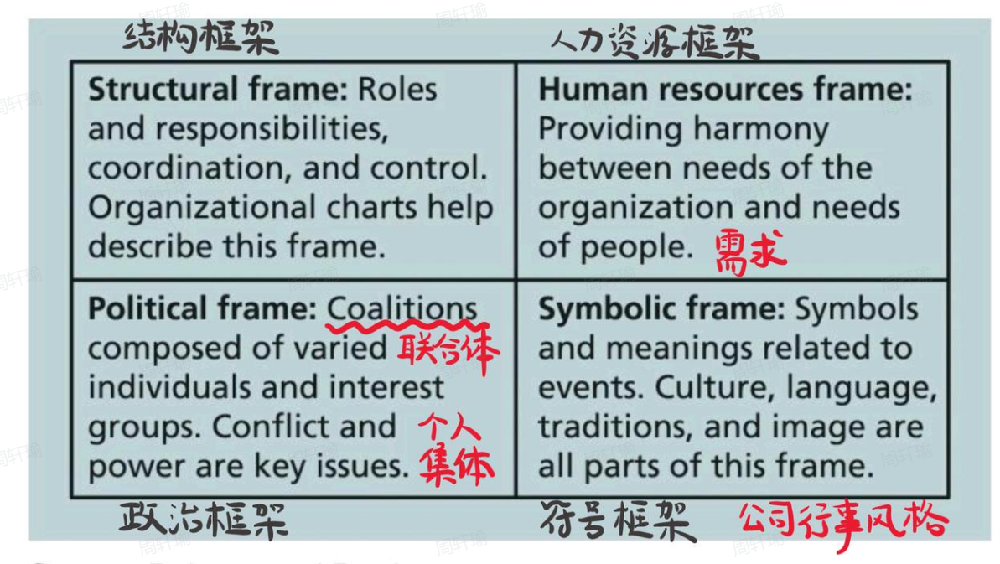
### 组织结构
- 职能型
- 项目型
- 矩阵型
### 组织文化
- 一套共享的假设、价值观和行为 ，它们定义了一个组织的运作方式。
- 很多专家认为，公司出问题的根本原因，往往不是结构或员工，而是文化。
### 项目生命周期
一系列项目阶段的集合，定义了每个阶段的任务，已经什么时候给出什么样的可交付成果。
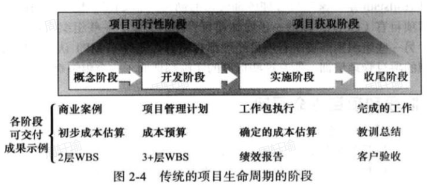
### 敏捷开发方法（Scrum）
一种迭代方法
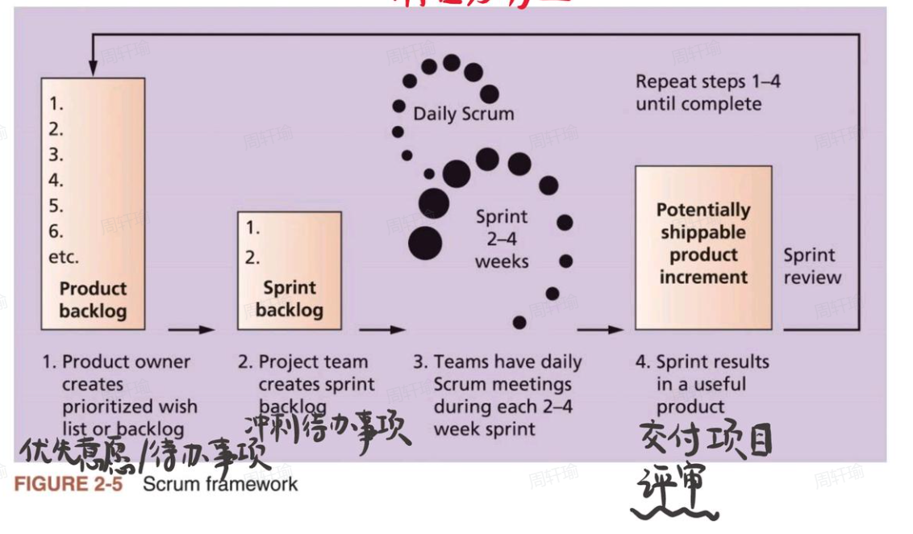
## ch3
### 项目管理过程组
- 启动
- 计划
- 执行
- 监控
- 收尾
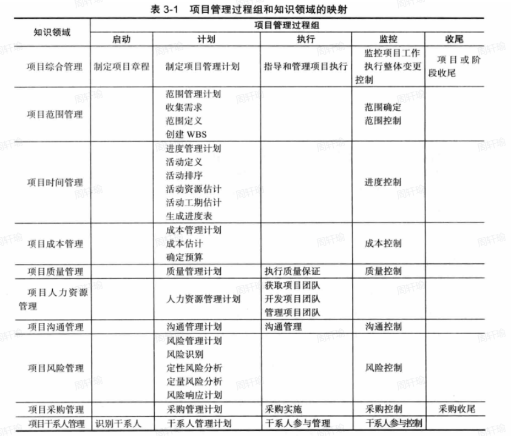
## ch4 综合管理
### 项目综合管理
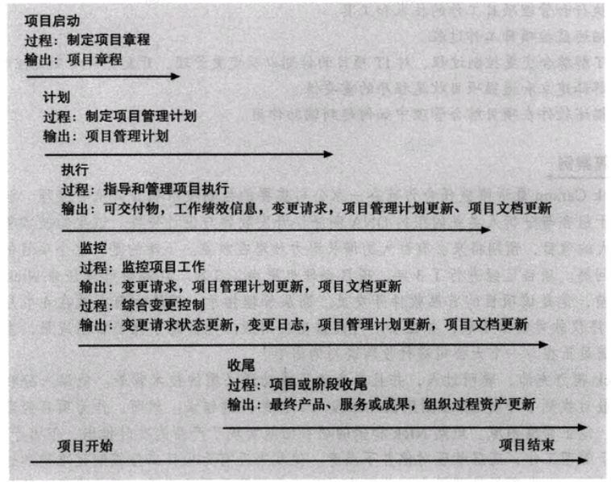
### SWOT分析
分析战略计划
- 优势
- 劣势
- 机遇
- 危险
思维导图法
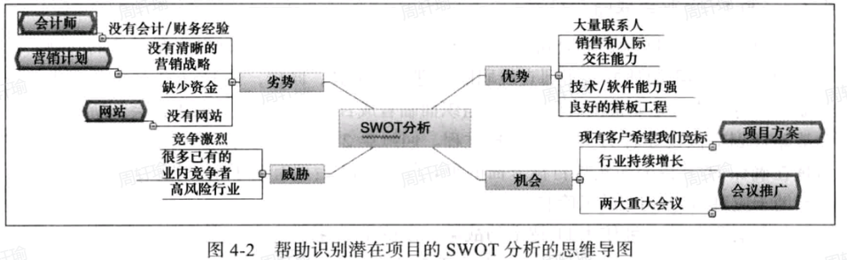
## ch5 范围管理
### 项目范围管理涉及的6个主要过程
- 制定范围管理计划
- 收集需求
- 定义范围
- 创建工作分解结构（WBS）
- 验证范围
- 控制范围
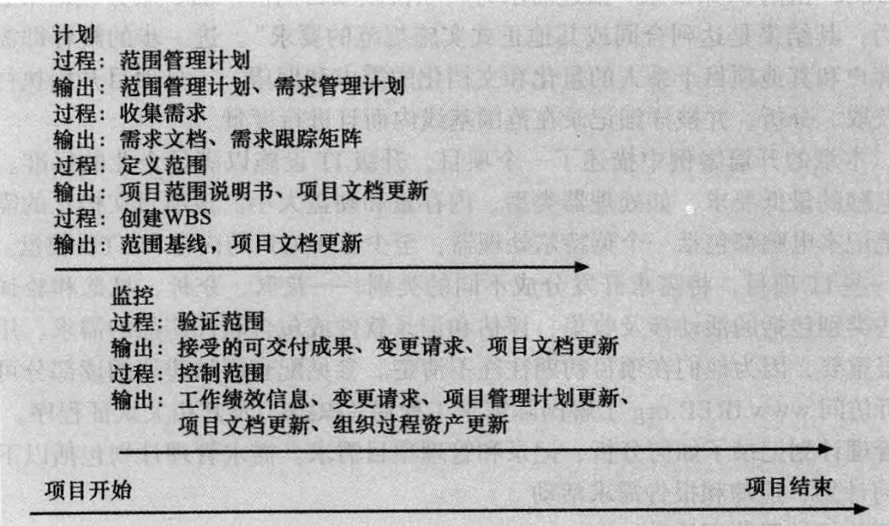
### 范围管理计划包括哪些信息？
- 如何准备一个详细的范围说明书
- 如何创建一个WBS
- 如何维护和批准WBS
- 如何获得正式验收已完成的项目可交付成果
- 如何控制项目范围变更的请求
### 收集需求的常用方法
- 与项目干系人一对一访谈
- 使用焦点小组会议、引导式研讨会、群体创新和决策技术
- 问卷调查法
- 观察法
- 原型法和文档分析法
- 基准测试
### 制定工作分解结构（WBS）的方法
- 使用指南
- 类比法
- 自上而下法
- 自下而上法
- 思维导图法
### 范围控制的目标
- 影响那些导致范围变更的因素
- 确保变更是按照综合变更控制中开发的过程来处理的
- 当变更出现的时候对其进行管理 
### 公司应遵循哪些最佳实践来避免出现主要的范围问题？
- 范围要符合实际
- 使用户参与项目范围管理
- 如果可能，使用现有的硬件和软件
- 遵守良好的项目管理过程
### 范围蔓延产生的原因？是否可以避免？如何预防范围蔓延的产生？
1）确保自己明白项目的范围；
2）了解你自己认为重要的东西和项目主管认为重要的东西； 
3）定义你的项目发布目标并让项目主管同意它们； 
4）把经过同意的项目发布目标细化成具体的工作要求；
5）将项目分解成大的和小的里程碑并编写一个大概的项目时间表以获得项目主管的同意； 
6）一旦时间表已经创立，那么你就需要使用一个 PERT图表或者任务分配表来分配资源和确定项目的关键路径；
7）意识到会出现项目范围蔓延。尽早填写项目范围改变要求表格并在开发的过程中说服项目主管
### 概念
- 范围（Scope）是指开发项目产品所涉及的所有 工作 和用来开展工作的所有过程。
- 可交付成果（deliverable）指作为项目的一部分而生产的产品，可交付成果可以是产品相关的，比如一套硬件或软件、计划文件或会议记录。
- 项目范围管理 (project scope management) 是指对项目包括什么与不包括什么的界定和控制的过程。它确保项目团队和于系人在项目开发什么产品以及开发产品使用什么过程这两方面达成共识。
- 范围验证（Scope Validation）包括了正式接受已经完成的可交付项目成果。
### WBS
- 工作分解结构（WBS）是对项目所涉及的工作面向交付成果的分组，它定义了项目的全部范围。
- WBS 是项目管理中的基础文档，因为它提供了计划和管理项目进度、成本、资源和变更的基础。
- 分解（Decomposition）是把项目可交付成果划分为更小的部分。
- 一个工作包（work package）即为 WBS 最底层的一项任务。
- 范围目标计划（scope baseline）包括已批准的项目范围声明及其关联的 WBS 和 WBS 字典。
- WBS 字典是一个描述 WBS 每项条目详细信息的文件。
- 批准的项目范围说明书和与之相关的WBS和WBS字典构成了范围基线(scope baseline)。实现项目范围目标的绩效就是基于这样的范围基线。
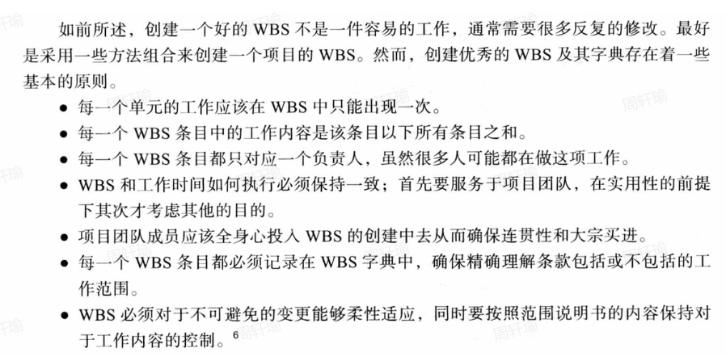
## ch6 时间管理
### 1、项目时间管理中的七个主要过程？
- 计划进度管理
- 定义活动
- 排序活动
- 估算活动资源
- 估算活动工期
- 制订进度计划
- 控制进度
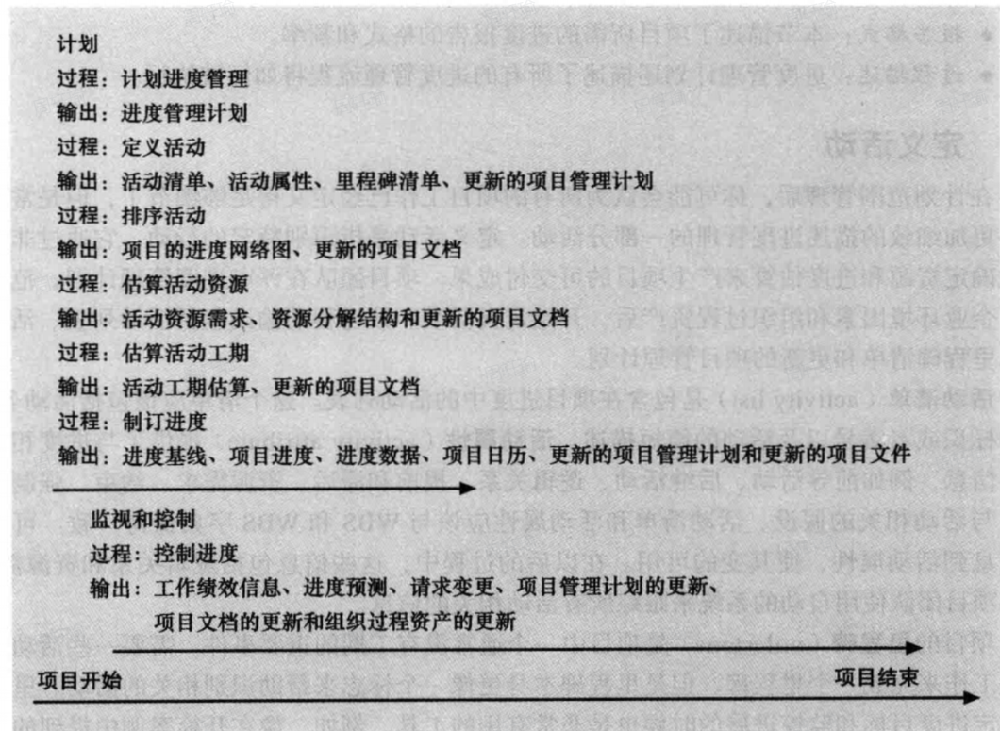
### 2、一个进度管理计划应该包括哪些信息？
- 项目进度模型的开发
- 在开发项目进度模型中使用的方法和工具
- 精度水平和计量单位
- 控制阈值
- 性能测量的规则
- 报告格式
- 过程描述
### 3、依赖的三种类型
- 强制依赖：项目工作中内在关系，写代码之前不能测试代码
- 自由依赖：项目团队定义的项目活动的关系
- 外部依赖：项目和非项目活动之间的关系
### 4、辅助进度制订过程的工具和技术有哪些？
甘特图
关键路径分析
关键链进度法
PERT分析
### 5、SMART准则是怎样定义里程碑的？
Specific 明确的
Measurable 可度量的
Assignable 可分配的
Realistic 现实的
Time-framed 有时间限制的
### 6、使用关键路径来缩短项目进度有哪三个主要技术？
为活动分配更多的资源或者改变它们的范围
赶工
快速跟进
### 概念
- 活动或任务是工作分解结构 （WBS） 中通常包含的工作元素，具有预期的持续时间、成本和资源要求。
- 活动清单：活动名称，活动表示，活动描述
- Activity attributes provide more information such as predecessors, successors, logical relationships, leads and lags, resource requirements, constraints, imposed dates, and assumptions related to the activity
- A milestone is a significant event that normally has no duration （没有工期的重要事件）
- ADM = AOA （网络图）
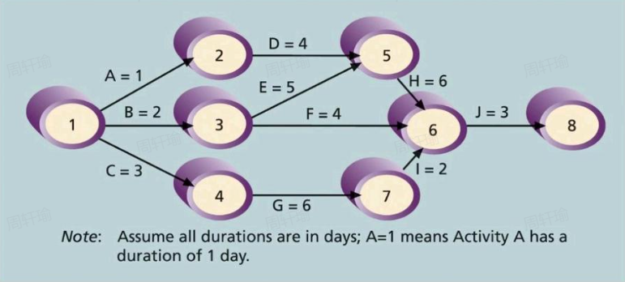
- PDM（前导图）
- PETR（计划评审技术）：四倍最可能时间加权
- CPM：关键路径法
## ch7 成本管理
### 1、项目成本管理的4个过程
- 计划成本管理
- 成本估算
- 确定预算
- 成本控制
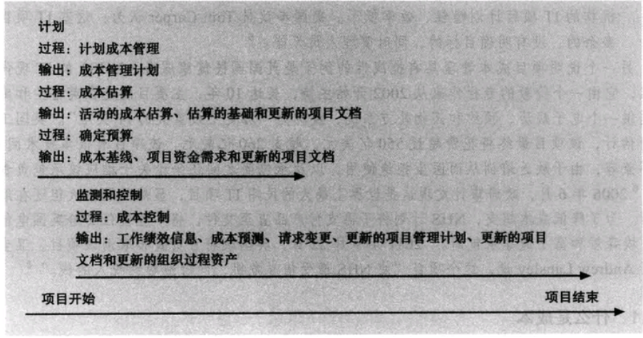
### 2、成本管理计划应该包括哪些信息？
精确度
测量单位
组织程序链接
控制临界值
绩效测量规划
报告模板
过程描述
### 3、三种基本的成本估算类型
粗粒度估算
预算估算
确定性估算
### 4、成本估算的工具和技术有哪些？
类比估算（自上而下估算）
自下而上估算
三点估算
参数估算
### 概念
- 成本：实现特定目标需要放弃的资源
- 项目成本管理包括确保项目在批准的预算内完成所需的流程
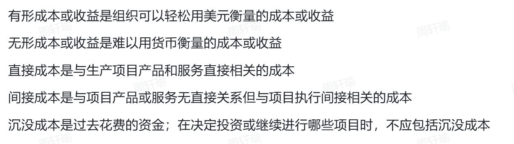
## ch8 质量管理
### 1、项目质量管理的3个过程
计划质量管理
实施质量保证
控制质量
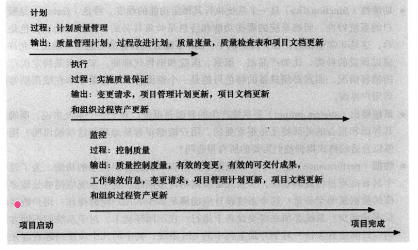
### 2、IT项目中影响质量的重要范围部分包括什么？
功能性和特色
系统输出
性能
可靠性
可维护性
### 3、质量控制过程的主要输出是什么？
验收决策
返工
过程调整
### 4、7种基本的质量工具
- 因果图
- 控制图
- 检查表
- 散点图
- 直方图
- 帕累托图（28定理：百分之20的原因导致了百分之80的问题）
- 流程图
### 5、DMAIC改进过程代表哪五个阶段
界定（define）
度量（measure）
分析（analyze）
改进（improve）
控制（control）
### 概念
- 质量：需求一致性（满足书面要求） + 适用性（被预期一样使用）
- 
### 2. CMMI 的 5 个等级
请务必记住这 5 个层级的**名称**和**核心特征**（关键词）：

#### **第 1 级：初始级 (Initial)** —— **“混乱 (Chaotic)”**
*   **特征**：
    *   **无序、混乱**。
    *   成功全靠**个人英雄主义**（全靠某个牛逼的程序员熬夜加班），而不是靠流程。
    *   一旦这个牛人走了，项目就崩了。
    *   **不可预测**：不知道什么时候能做完，也不知道质量咋样。

#### **第 2 级：已管理级 (Managed)** —— **“可重复 (Repeatable)”**
*   **特征**：
    *   建立了**基本的项目管理**流程（如配置管理、需求管理）。
    *   **可重复**：如果以前做过类似的项目成功了，这次大概率也能成功。
    *   **关键词**：**项目级**。流程主要在项目内部有效，不同项目组的玩法可能不一样。

#### **第 3 级：已定义级 (Defined)** —— **“标准化 (Standardized)”**
*   **特征**：
    *   **组织级**的标准流程。
    *   全公司（不管哪个项目组）都用**同一套**标准流程进行开发和管理。
    *   **剪裁 (Tailoring)**：项目组可以根据公司的标准流程，结合项目特点进行适当修改。
    *   **关键词**：**文档化、标准化**。

#### **第 4 级：量化管理级 (Quantitatively Managed)** —— **“数字化 (Data-driven)”**
*   **特征**：
    *   **用数据说话**。
    *   建立了量化的质量目标，使用统计学方法来管理流程。
    *   能精确预测项目结果（比如：“我有95%的把握在3天内做完，Bug率不超过2%”）。
    *   **关键词**：**统计控制、量化预测**。

#### **第 5 级：优化级 (Optimizing)** —— **“持续改进 (Continuous Improvement)”**
*   **特征**：
    *   不是“到了顶峰就不动了”，而是**关注流程的持续改进**。
    *   主动寻找新技术、新工具来优化流程，消除产生缺陷的根本原因。
    *   **关键词**：**创新、缺陷预防**。

## ch9 人力资源管理
### 1、项目人力资源管理的4个过程
计划人力资源管理
组建项目团队
建设项目团队
管理项目团队
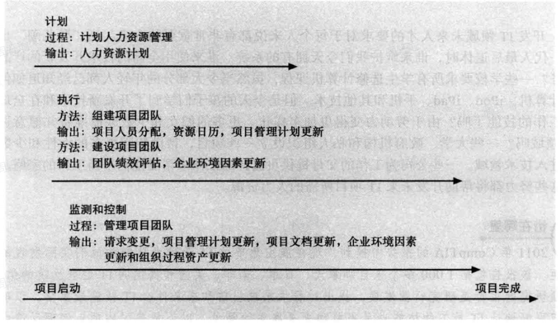
### 2、马斯洛需求层次理论从低到高是哪几层？
生理需求
安全需求
社交需求
尊重需求
自我实现

### 3、项目经理运用哪7种习惯来提高项目工作的效率？
积极主动
开始执行时心中就已规划如何结束
优先的事优先做
考虑双赢
首先寻求理解别人，然后再寻求被别人理解
协同
“磨快锯子”
### 4、资源平衡的优点是什么
（1）当资源的使用情况比较稳定时，它们需要的管理就较少
（2）资源平衡可使项目经理通过使用分包商或者其他昂贵的资源而使用零库存策略
（3）资源平衡可以减少财务部与项目人员方面的一些问题
（4）资源平衡还可以提高士气
### 5、塔克曼模型描述的团队建设的5个阶段？
形成阶段
震荡阶段
规范阶段
执行阶段
终止阶段
### 6、管理项目团队的工具和技术
观察与交谈
项目绩效评价
人际技能
冲突管理
## ch10 沟通管理
### 三个主要过程

### 1、项目沟通管理的5个过程
识别利益相关者；
规划沟通；
分布信息；
管理利益相关者期望；
报告绩效；
### 2、项目沟通管理计划应包括哪些内容？
干系人的沟通需求；
需要沟通的信息，包括语言、内容、格式、详细程度；
产生和接收信息的个人或小组；
传达信息的推荐方式或技术；
沟通频率；
为解决问题所需的向上提报程序；
更新沟通管理计划的再版程序；
常用术语表；
### 3、发布信息应该注意哪些方面？
增加沟通的频次；
理解小组和个人的沟通需求；
同时使用正式与非正式沟通；
用有效、适时的方式发布重要信息；
选择适当的交流媒介；
为坏消息搭建语境；
确定沟通渠道的数量；
### 4、期望管理矩阵包括哪些条目？
标准；
优先权；
期望；
各项标准的衡量指南；
### 5、绩效报告
状态报告；
进度报告；
预测；
### 6、改善沟通的一些建议
使用沟通技巧来管理冲突；
开发更好的沟通技巧；
召开有效的会议；
有效使用电子邮件、即时通讯等协作工具；
使用项目沟通模板；
### 7、如何有效开会？
确定会议是否必要；
定义会议目的和预期产出；
决定会议参与人；
在会议开启前提供会议议程；
准备手稿和直观教具，提前做好后勤安排；
专业地开会；
为会议制定基本要求；
建立关系；
### 8、如何更高效使用电子邮件或其他通讯工具？
选择最适合的媒介；
确保信息发送给了正确的人；
在邮件中使用有意义的主题行，并尽量将内容限制在一个主题下，如果有其他主题，那么就发另外的邮件；
确保授权了合适的人来分享协作文档；

## ch11 风险管理
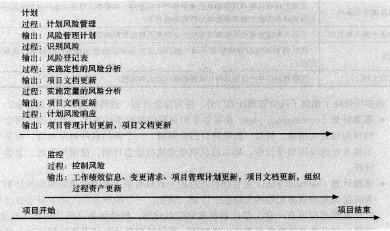
### 1. 风险的基本概念
*   **定义**：风险是损失或损害的可能性，涉及不确定性。风险既包括消极的（威胁），也包括积极的（机会）。
*   **风险偏好 (Risk Appetite)**：实体为了获得期望回报愿意承担的不确定性程度。
*   **风险承受力 (Risk Tolerance)**：实体能接受的最大偏差。
*   **风险效用 (Risk Utility)**：从潜在回报中得到的满意度。
    *   **风险厌恶型 (Risk-averse)**：效用随回报增加而递减（更求稳）。
    *   **风险中性型 (Risk-neutral)**：效用与回报成正比（理性平衡）。
    *   **风险喜好型 (Risk-seeking)**：效用随回报增加而递增（愿意冒险博取高收益）。

### 2. 项目风险管理的六个主要过程
项目风险管理旨在使潜在的负面风险最小化，同时使潜在的正面风险最大化。

#### (1) 计划风险管理 (Plan Risk Management)
*   **定义**：决定如何编制与计划风险管理活动。
*   **主要输出**：**风险管理计划**。它包含方法论、角色与责任、预算、时间安排、风险类别（RBS）等。
*   **关键概念**：
    *   **应急计划 (Contingency Plan)**：针对已识别的风险事件，如果发生则采取的预先规定的措施。
    *   **退路计划 (Fallback Plan)**：当应急计划无效时实施的计划。
    *   **应急储备 (Contingency Reserve)**：用于减轻已知的、但不可控风险的资金（已知-未知）。
    *   **管理储备 (Management Reserve)**：用于未知的风险（未知-未知）。

#### (2) 识别风险 (Identify Risks)
*   **定义**：判断哪些风险会影响项目，并将其特性形成文档。
*   **工具与技术**：
    *   **头脑风暴**：收集创意的常用方法。
    *   **德尔菲技术 (Delphi Technique)**：专家匿名达成共识，避免偏见和个人影响。
    *   **访谈**：面对面收集信息。
    *   **SWOT 分析**：分析优势、劣势、机会、威胁。
    *   **风险分解结构 (RBS)**：按类别（如市场、财务、技术、人员）层级化排列风险。
*   **主要输出**：**风险登记表 (Risk Register)**。包含风险事件列表、触发器（征兆）、潜在应对措施等。

#### (3) 实施定性风险分析 (Perform Qualitative Risk Analysis)
*   **定义**：评估风险发生的概率和影响，对风险进行优先排序。
*   **工具**：
    *   **概率/影响矩阵**：将风险分为高、中、低级。
    *   **十大风险事项跟踪**：保持对最重大风险的关注。

#### (4) 实施定量风险分析 (Perform Quantitative Risk Analysis)
*   **定义**：量化分析风险对项目目标的财务或时间影响。
*   **工具**：
    *   **决策树与预期货币价值 (EMV)**：
        *   公式：**EMV = 概率 × 影响 (货币值)**。
        *   用于帮助选择最佳行动方案。
    *   **模拟 (Simulation)**：如**蒙特卡罗分析 (Monte Carlo analysis)**，通过多次模拟计算项目结果的概率分布。

#### (5) 计划风险响应 (Plan Risk Responses)
*   **定义**：针对风险制定方案，决定如何应对。
*   **消极风险（威胁）的 4 种策略**：
    1.  **规避 (Avoidance)**：消除威胁或其原因（如修改计划、取消项目）。
    2.  **承担/接受 (Acceptance)**：接受后果（如建立应急储备）。
    3.  **转移 (Transference)**：将责任转给第三方（如购买保险、外包）。
    4.  **缓解 (Mitigation)**：降低发生的概率或影响（如采用成熟技术）。
*   **积极风险（机会）的 4 种策略**：
    1.  **开发 (Exploitation)**：确保机会肯定发生。
    2.  **共享 (Sharing)**：分配给最能利用该机会的第三方。
    3.  **增强 (Enhancement)**：提高发生的概率或积极影响。
    4.  **接受 (Acceptance)**：乐意利用，但不主动追求。
*   **相关概念**：
    *   **残余风险 (Residual risks)**：采取措施后剩下的风险。
    *   **二次风险 (Secondary risks)**：实施应对措施直接导致的直接新风险。

#### (6) 控制风险 (Control Risks)
*   **定义**：在整个项目生命周期中监测已知风险、识别新风险、执行风险应对计划。
*   **工具**：风险再评估、风险审计、技术绩效监测。
*   **权变措施 (Workarounds)**：针对未计划的风险事件（即未在风险登记表中识别的风险）采取的临时应对措施。
## ch12 采购管理
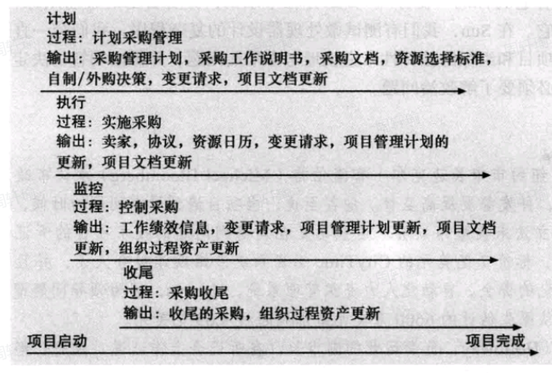
### 1. 核心概念与逻辑
*   **定义**：从项目团队外部获取产品、服务或结果的过程。
*   **角色**：
    *   **买方 (Buyer)**：甲方，出钱的。
    *   **卖方 (Seller)**：乙方，供应商，承包商。
*   **四个主要过程**：
    1.  **计划采购管理**：决定买什么，什么时候买，怎么买（自制还是外购？签什么合同？）。
    2.  **实施采购**：发标书，选供应商，签合同。
    3.  **控制采购**：盯着供应商干活，管变更，付钱。
    4.  **结束采购**：验收，结账，归档。

---

### 2. 核心考点一：自制/外购分析 (Make-or-Buy Analysis)
这是计划阶段最重要的工具。
*   **逻辑**：是自己团队做便宜，还是花钱买便宜？（不仅要看直接成本，还要看间接成本和管理成本）。
*   **计算题**（参考课本 Page 353 的例子）：
    *   *租设备*：每天 800 美元。
    *   *买设备*：一次性 12,000 美元 + 每天维护费 400 美元。
    *   **平衡点计算**：设 $d$ 天时成本相等。
        $$ 800d = 12,000 + 400d $$
        $$ 400d = 12,000 $$
        $$ d = 30 $$
    *   **结论**：如果项目少于 30 天，就租；多于 30 天，就买。

---

### 3. 核心考点二：合同类型 (Contract Types) 
这是本章最难也是最重要的部分，重点在于**风险是谁承担的**（参考课本 Page 350-352 及图 12-2）。

#### A. 固定总价合同 (Fixed-Price, FP)
*   **特征**：一口价。不管乙方花了多少钱，甲方只给这么多。
*   **风险**：**卖方（乙方）承担最大风险**。如果物价上涨或工期延误，乙方得自己贴钱。
*   **适用**：范围定义非常清晰明确的项目。
*   **变体**：
    *   **FFP (Firm Fixed Price)**：最常用，价格完全死板，除非范围变了否则不改。
    *   **FPIF (Incentive Fee)**：总价 + 激励费（干得好有奖金，有最高限价）。
    *   **FP-EPA (Economic Price Adjustment)**：允许根据通货膨胀调整价格（适用于跨度好几年的长项目）。

#### B. 成本补偿合同 (Cost-Reimbursable, CR)
*   **特征**：实报实销 + 一笔利润。乙方花多少，甲方给多少。
*   **风险**：**买方（甲方）承担最大风险**。因为乙方可能故意拖延或浪费，反正甲方买单。
*   **适用**：范围不清楚，或者需要探索的研究型项目（R&D）。
*   **变体**：
    *   **CPFF (Fixed Fee)**：成本 + 固定的一笔利润。
    *   **CPIF (Incentive Fee)**：成本 + 激励费（省钱了大家分，超支了大家摊）。
    *   **CPPC (Percentage of Cost)**：成本 + 成本的百分比作为利润。
        *   *注意*：**这是对甲方最差的合同**，被美国联邦政府禁用。因为乙方花得越多，赚得越多，毫无节约动力。

#### C. 工料合同 (Time and Material, T&M)
*   **特征**：混合型。按“单价”算（比如程序员每小时 100 块）。
*   **风险**：中等。
*   **适用**：工期短、紧急、或者只能定义大概范围的小项目。通常会设一个“最高限价”来控制风险。

---

### 4. 核心考点三：采购文档 (Procurement Documents)
你要发给供应商的文件叫什么？（参考课本 Page 355）

*   **RFP (Request for Proposal, 建议书邀请函)**：
    *   **场景**：我知道我有问题，但我不知道怎么解决，**请你提供方案**。
    *   *侧重*：比拼技术方案和方法。
*   **RFQ (Request for Quote, 报价邀请函)**：
    *   **场景**：我要买的东西很标准（比如 100 台戴尔电脑），**请你报价**。
    *   *侧重*：比拼价格。
*   **SOW (Statement of Work, 工作说明书)**：
    *   描述采购工作的范围。一定要写得足够清楚，否则以后扯皮。

---

### 5. 控制与结束采购
*   **控制采购**：
    *   **建设性变更 (Constructive Change)**：这是个坑。指甲方虽然没有书面要求变更，但通过行为（比如口头指挥）导致乙方工作量增加。这往往会导致索赔。
*   **结束采购**：
    *   **采购审计 (Procurement Audits)**：总结经验教训，看采购过程有啥问题。
    *   必须在项目结束前先结束所有采购合同。

## ch13 干系人管理
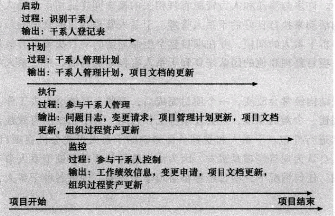
### 1. 核心逻辑：谁是干系人？
*   **定义**：任何能**影响**项目决策、活动或结果，或者被项目**影响**的个人、群体或组织。
*   **范围**：不仅包括支持你的人（盟友），也包括**反对你的人（敌人）**。
*   **管理目标**：让支持者更支持，让反对者不捣乱（或者转为中立/支持）。

---

### 2. 四个主要过程 (The 4 Processes)
参考课本 Page 368 的图 13-1，流程非常清晰：

1.  **识别干系人 (Identify Stakeholders)**
    *   **时机**：项目**启动阶段**就要做，而且要在整个项目期间持续做。
    *   **输出**：**干系人登记表 (Stakeholder Register)**（参考 Page 369 表 13-1）。
        *   记录名字、职位、是内部还是外部、联系方式等。
        *   *考点*：这份表格里有些敏感信息（比如“这个人很难搞”）**不能**公开发给所有人看。

2.  **计划干系人管理 (Plan Stakeholder Management)**
    *   **做什么**：制定策略。怎么对付这些人？
    *   **核心工具**：**干系人参与评估矩阵**。
        *   把干系人分为 5 种状态：**无意识、抗拒、中立、支持、领导**。
        *   目标是把他们从“当前状态 (C)”移动到“期望状态 (D)”。

3.  **管理干系人参与 (Manage Stakeholder Engagement)**
    *   **做什么**：**实际行动**。去沟通、去开会、去谈判。
    *   **核心工具**：**问题日志 (Issue Log)**。记录谁有什么意见，解决没解决。

4.  **控制干系人参与 (Control Stakeholder Engagement)**
    *   **做什么**：**监控**。看看策略管不管用，不管用就调整计划。

---

### 3. 核心考点一：权力/利益网格 (Power/Interest Grid)
参考课本 Page 370 的图 13-2，这是分析干系人最重要的工具。根据干系人的**权力（Power）**和**利益/关注度（Interest）**把他们分成四类，采取不同策略：

| 象限 | 特征 | 策略 (Strategy) | 例子 |
| :--- | :--- | :--- | :--- |
| **高权力、高利益** | 说了算，又很关心项目 | **重点管理 (Manage Closely)** | 项目发起人 (Sponsor)、大客户 |
| **高权力、低利益** | 说了算，但不太关心 | **令其满意 (Keep Satisfied)** | 职能部门经理（别惹他，他能卡你资源） |
| **低权力、高利益** | 没权，但很关心 | **随时告知 (Keep Informed)** | 最终用户、项目组成员 |
| **低权力、低利益** | 没权，也不关心 | **监督 (Monitor)** | 路人甲，偶尔看一眼即可 |

---

### 4. 核心考点二：期望管理矩阵 (Expectations Management Matrix)
*   **核心逻辑**：不同的干系人对成功的定义不一样。
    *   *CFO（财务总监）* 可能只在乎“省钱”。
    *   *CTO（技术总监）* 可能只在乎“技术先进”。
*   **PM 的任务**：必须把这些**相互冲突的期望**列出来，排优先级，然后去平衡它们。你不可能让所有人都 100% 满意，但要管理他们的预期。
-------------------------
-------------------------
# 概念默写
## ch1
### 1. Project (项目)
*   **核心定义**：
    A temporary endeavor undertaken to create a unique product, service, or result.  
    （为创造一种独特的产品、服务或成果而进行的临时性努力。）
*   **适当拓展**：
    *   项目是临时的（Temporary），有明确的开始和结束。
    *   项目结束的标志是目标已达成或项目被终止。
    *   项目与运营（Operations）不同，运营是持续进行的（sustain the business），而项目是独特的。

### 2. Project Management (项目管理)
*   **核心定义**：
    The application of knowledge, skills, tools, and techniques to project activities to meet project requirements.  
    （将知识、技能、工具和技术应用于项目活动，以满足项目的要求。）
*   **适当拓展**：
    *   项目经理需要努力满足“三重约束”（范围、时间和成本）。
    *   同时也需要协调整个过程以满足干系人（Stakeholders）的需求和期望。

### 3. Project Attributes (项目属性)
*   **核心定义**：
    项目具有以下主要特征：
    1.  **Unique purpose**（有一个特定的目的/独特的目标）。
    2.  **Temporary**（临时性的）。
    3.  **Progressive elaboration**（随着信息明细而逐步完善/渐进明细）。
    4.  **Resources**（需要来自不同领域的资源）。
    5.  **Primary customer or sponsor**（有一个主要客户或发起人）。
    6.  **Uncertainty**（含有不确定性）。

### 4. Project Manager (Hard and Soft Skills) (项目经理及其技能)
*   **核心定义**：
    项目经理是与项目发起人、团队及其他参与者合作以实现项目目标的人。他们通常兼具领导者（Leader，关注长期目标和大局）和管理者（Manager，关注日常细节）的角色。
*   **技能分类**：
    *   **Hard Skills (硬技能)**：包括产品知识，以及知道如何使用各种项目管理工具和技术（如制定计划、进度表等）。
    *   **Soft Skills (软技能)**：与人打交道的能力。
        *   **Communication**（沟通）：倾听、说服。
        *   **Leadership**（领导力）：设定榜样、提供愿景、激励团队。
        *   **Team-building**（团队建设）：展现同理心、激励士气。
        *   **Conflict resolution**（冲突解决）。
        *   **Coping skills**（应对技能）：灵活、耐心、坚持。

### 5. Triple Constraint (三重约束)
*   **核心定义**：
    项目管理必须平衡的三个经常相互竞争的目标：
    1.  **Scope** (范围)：What work will be done? (做什么工作？)
    2.  **Time** (时间)：How long should it take to complete? (需要多长时间？对应进度 Schedule)
    3.  **Cost** (成本)：What should it cost? (花多少钱？对应预算 Budget)
*   **适当拓展**：
    *   项目经理需要在三者之间进行平衡，以达到高质量（Quality）和客户满意度。
    *   通常用三角形表示（Slide 22），改变其中一边通常会影响另外两边。

### 6. PMI
*   **核心定义**：
    **Project Management Institute** (项目管理协会)。
*   **适当拓展**：
    *   成立于1969年的国际性项目经理专业协会。
    *   负责制定行业标准（如 PMBOK 指南）、提供认证（如 PMP）以及以此推动项目管理职业的发展。

### 7. PMO
*   **核心定义**：
    **Project Management Office** (项目管理办公室)。
    是一个负责在整个组织内协调项目管理职能的组织团队（Organizational group）。
*   **适当拓展**：
    *   许多公司建立 PMO 是为了应对项目数量和复杂性的增加。
    *   PMO 帮助组织标准化管理流程和资源。

### 8. PMP
*   **核心定义**：
    **Project Management Professional** (项目管理专业人士)。
*   **适当拓展**：
    *   由 PMI 提供的专业认证。
    *   获得认证需要具备足够的项目经验，同意遵守道德准则（Code of Ethics），并通过 PMP 考试。
    *   是项目管理领域公认的高含金量证书。

## ch2
### 1. Deliverable (可交付成果)
*   **核心定义**：
    A product or service produced or provided as part of a project.  
    （作为项目一部分所提供的一种产品或服务。）
*   **适当拓展**：
    *   例如：一份技术报告、一个培训项目、或者硬件（Technical reports, a training session, or hardware）。
    *   可交付成果通常在每个阶段结束时产生。

### 2. Project Life Cycle (项目生命周期)
*   **核心定义**：
    A collection of project phases that defines:
    1.  what work will be performed in each phase;
    2.  what deliverables will be produced and when;
    3.  who is involved in each phase;
    4.  how management will control and approve work produced in each phase.
    （项目阶段的集合，它定义了每个阶段做什么工作、产出什么成果、谁参与以及管理层如何控制和批准工作。）
*   **适当拓展**：
    *   **传统项目生命周期**包括四个阶段：
        1.  **Concept** (概念阶段)
        2.  **Development** (开发阶段)
        3.  **Implementation** (实施阶段)
        4.  **Close-out** (收尾阶段)
    *   前两个阶段侧重于**Project Feasibility**（项目可行性），后两个阶段侧重于**Project Acquisition**（项目获取/实施）。

### 3. Systems Development Life Cycle (SDLC) (系统开发生命周期)
*   **核心定义**：
    A framework for describing the phases involved in developing and maintaining information systems.  
    （用来描述开发和维护信息系统所涉及的各个阶段的框架。）
*   **适当拓展**：
    *   **Predictive life cycle (预测型)**：范围明确，进度和成本可以预测（如 Waterfall 瀑布模型）。
    *   **Adaptive Software Development (ASD) life cycle (自适应型)**：需求不明确，基于组件和任务驱动，使用基于时间的周期（如 Agile 敏捷）。

### 4. Organizational Structures (组织结构)
*   **核心定义**：
    三种基本的组织结构形式：
    1.  **Functional (职能型)**: Functional managers report to the CEO.  
        （职能经理向CEO汇报。层级结构，员工具有专业技能。）
    2.  **Project (项目型)**: Program managers report to the CEO.  
        （项目经理向CEO汇报。也是层级结构，但项目经理权力较大。）
    3.  **Matrix (矩阵型)**: Middle ground between functional and project structures; personnel often report to two or more bosses.  
        （介于职能型和项目型之间的中间状态；人员通常向两个或更多的上司汇报。）
*   **适当拓展**：
    *   在矩阵型结构中，员工通常同时向**职能经理**（Functional Manager）和**项目经理**（Project Manager）汇报。

## ch3
### 1. The Five Project Management Process Groups (五大项目管理过程组)
*   **核心定义**：
    项目管理过程组是朝着特定结果的一系列行动（series of actions）。它们包括：
    1.  **Initiating** (启动)：Defining and authorizing a project or project phase.  
        （定义并授权一个项目或项目阶段。）
    2.  **Planning** (计划)：Devising and maintaining a workable scheme.  
        （制定并维护一个可行的方案/计划。）
    3.  **Executing** (执行)：Coordinating people and other resources.  
        （协调人员和其他资源来实施计划。）
    4.  **Monitoring and Controlling** (监控)：Regularly measuring and monitoring progress to ensure project objectives are met.  
        （定期测量和监控进度，确保达成项目目标。）
    5.  **Closing** (收尾)：Formalizing acceptance of the project or project phase and ending it efficiently.  
        （正式验收项目或阶段并高效结束它。）
*   **适当拓展**：
    *   **执行过程组 (Executing)** 通常花费最多的时间和资源（参见 Slide 5 图表）。
    *   监控过程组贯穿于所有阶段。

### 2. Process Groups and Knowledge Areas Mapping (过程组与知识领域映射)
*   **核心定义**：
    Main activities of each PM process group can be mapped into the ten knowledge areas.  
    （每个过程组的主要活动都可以映射到十大知识领域中。）
*   **适当拓展**：
    *   你需要记住这种映射关系（参考 Table 3-1, Slide 9-10）。
    *   **Planning (计划)** 过程组包含了来自**每一个**知识领域的活动（Note that there are activities from each knowledge area under the planning process groups）。

### 3. Remember All Processes in Each KA (记住各知识领域的主要过程)
*根据 Slide 9-10 (Table 3-1) 的映射表，以下是重点过程默写（建议按知识领域记忆）：*

*   **Integration (整合)**:
    *   Initiating: **Develop project charter** (制定项目章程)
    *   Planning: **Develop project management plan** (制定项目管理计划)
    *   Executing: **Direct and manage project work** (指导与管理项目工作)
    *   M&C: **Monitor and control project work** (监控项目工作), **Perform integrated change control** (实施整体变更控制)
    *   Closing: **Close project or phase** (结束项目或阶段)

*   **Scope (范围)**:
    *   Planning: **Collect requirements**, **Define scope**, **Create WBS** (收集需求, 定义范围, 创建WBS)
    *   M&C: **Validate scope**, **Control scope** (确认范围, 控制范围)

*   **Time (时间)**:
    *   Planning: **Define activities**, **Sequence activities**, **Estimate activity resources**, **Estimate activity durations**, **Develop schedule** (定义活动, 排列活动顺序, 估算活动资源, 估算活动工期, 制定进度计划)
    *   M&C: **Control schedule** (控制进度)

*   **Cost (成本)**:
    *   Planning: **Estimate costs**, **Determine budget** (估算成本, 制定预算)
    *   M&C: **Control costs** (控制成本)

*   **Quality (质量)**:
    *   Planning: **Plan quality management** (规划质量管理)
    *   Executing: **Perform quality assurance** (实施质量保证)
    *   M&C: **Control quality** (控制质量)

*   **Human Resource (人力资源)**:
    *   Planning: **Plan human resource management** (规划人力资源管理)
    *   Executing: **Acquire project team**, **Develop team**, **Manage team** (组建项目团队, 建设团队, 管理团队)

*   **Communications (沟通)**:
    *   Planning: **Plan communications management** (规划沟通管理)
    *   Executing: **Manage communications** (管理沟通)
    *   M&C: **Control communications** (控制沟通)

*   **Risk (风险)**:
    *   Planning: **Plan risk management**, **Identify risks**, **Perform qualitative/quantitative risk analysis**, **Plan risk responses** (规划风险管理, 识别风险, 定性/定量风险分析, 规划风险应对)
    *   M&C: **Control risks** (控制风险)

*   **Procurement (采购)**:
    *   Planning: **Plan procurement management** (规划采购管理)
    *   Executing: **Conduct procurements** (实施采购)
    *   M&C: **Control procurements** (控制采购)
    *   Closing: **Close procurements** (结束采购)

*   **Stakeholder (干系人)**:
    *   Initiating: **Identify stakeholders** (识别干系人)
    *   Planning: **Plan stakeholder management** (规划干系人管理)
    *   Executing: **Manage stakeholder engagement** (管理干系人参与)
    *   M&C: **Control stakeholder engagement** (控制干系人参与)

*   **特别注意（Pre-initiation）**:
    *   **Develop business case** (制定商业论证) 是在项目启动**之前**完成的 (Pre-initiation task)，不属于上述正式过程组。

## ch4
### 1. Project Integration Management Processes (项目整合管理过程)
*   **核心定义**：
    Project integration management involves coordinating all of the other knowledge areas throughout a project’s life cycle. (项目整合管理涉及在整个项目生命周期中协调所有其他知识领域。)
    The main processes include (主要过程包括)：
    1.  **Develop Project Charter** (制定项目章程)
    2.  **Develop Project Management Plan** (制定项目管理计划)
    3.  **Direct and Manage Project Work** (指导和管理项目工作)
    4.  **Monitor and Control Project Work** (监控项目工作)
    5.  **Perform Integrated Change Control** (实施整体变更控制)
    6.  **Close Project or Phase** (结束项目或阶段)

### 2. Project Charter (项目章程)
*   **核心定义**：
    A document that **formally recognizes the existence of a project** and provides direction on the project’s objectives and management.  
    （一份正式承认项目存在并为项目目标和管理提供方向的文件。）
*   **适当拓展**：
    *   关键项目干系人应该在项目章程上签字，以确认他们同意项目的需求和意图。
    *   它是项目整合管理的一个关键输出。

### 3. Develop Project Management Plan (制定项目管理计划)
*   **核心定义**：
    Involves coordinating all planning efforts to create a **consistent, coherent document**—the project management plan.  
    （涉及协调所有计划工作，以创建一个一致、连贯的文档——项目管理计划。）
*   **适当拓展**：
    *   项目管理计划用于协调所有项目计划文档，并帮助指导项目的执行和控制。
    *   其他知识领域创建的计划是整体项目管理计划的子部分（subsidiary parts）。

### 4. NPV (Net Present Value) (净现值)
*   **核心定义**：
    A method of calculating the expected net monetary gain or loss from a project by **discounting all expected future cash inflows and outflows to the present point in time**.  
    （一种通过将所有预期的未来现金流入和流出折现到现在的时间点，来计算项目预期净货币收益或损失的方法。）
*   **适当拓展**：
    *   计算公式：$NPV = \sum [A_t / (1+r)^t]$。
    *   如果财务价值是关键标准，应考虑 NPV 为**正值**的项目。
    *   **The higher the NPV, the better** (NPV 越高越好)。

### 5. ROI (Return on Investment) (投资回报率)
*   **核心定义**：
    Calculated by subtracting the project costs from the benefits and then dividing by the costs.  
    （通过从收益中减去项目成本，然后除以成本来计算。）
    **ROI = (total discounted benefits - total discounted costs) / discounted costs**
*   **适当拓展**：
    *   **The higher the ROI, the better** (ROI 越高越好)。
    *   许多组织对项目有要求的最低回报率。

### 6. Weighted Scoring Model (加权评分模型)
*   **核心定义**：
    A tool that provides a systematic process for selecting projects based on many criteria.  
    （一种基于多种标准选择项目的系统化工具。）
*   **适当拓展**：
    *   步骤：识别标准 -> 分配权重（总和100%）-> 给每个项目打分 -> 计算加权得分。
    *   **The higher the weighted score, the better** (加权得分越高越好)。

### 7. Performing Integrated Change Control (实施整体变更控制)
*   **核心定义**：
    Involves identifying, evaluating, and managing changes throughout the project life cycle.  
    （涉及在整个项目生命周期中识别、评估和管理变更。）
*   **适当拓展**：
    *   三个主要目标：
        1.  影响造成变更的因素，确保变更是有益的。
        2.  确定变更已经发生。
        3.  当变更发生时，对其进行管理。
    *   现代观点认为项目管理是一个不断沟通和协商的过程，变更往往是有益的，应做好计划。

### 8. Change Control Board (CCB) (变更控制委员会)
*   **核心定义**：
    A formal group of people responsible for **approving or rejecting changes** on a project.  
    （一个负责批准或拒绝项目变更的正式人员团体。）
*   **适当拓展**：
    *   CCB 提供准备变更请求、评估变更请求以及管理已批准变更实施的指导方针。
    *   成员通常包括来自整个组织的干系人。
    *   为了应对 CCB 决策慢的问题，有些组织采用“48小时政策”或将决策权下放。

## ch5
### 1. Project Scope Management Processes (项目范围管理过程)
*   **核心定义**：
    Project scope management includes the processes involved in defining and controlling what is or is not included in a project.  
    （项目范围管理包括涉及定义和控制什么包含在项目内、什么不包含在项目内的过程。）
    The main processes include (主要过程包括)：
    1.  **Planning scope** (范围规划)：Determining how the project’s scope and requirements will be managed. (确定如何管理项目的范围和需求。)
    2.  **Collecting requirements** (收集需求)：Defining and documenting features and functions. (定义并记录特性和功能。)
    3.  **Defining scope** (定义范围)：Creating a scope statement. (创建范围说明书。)
    4.  **Creating the WBS** (创建WBS)：Subdividing deliverables into smaller components. (将可交付成果细分为更小的组件。)
    5.  **Validating scope** (确认范围/验证范围)：Formalizing acceptance of the project deliverables. (正式验收项目可交付成果。)
    6.  **Controlling scope** (控制范围)：Controlling changes to project scope. (控制项目范围的变更。)

### 2. Scope Planning (范围规划)
*   **核心定义**：
    The process of deciding how the scope will be defined, verified, and controlled, and how the WBS will be created.  
    （决定如何定义、验证和控制范围，以及如何创建WBS的过程。）
*   **适当拓展**：
    *   主要输出是 **Scope Management Plan** (范围管理计划) 和 **Requirements Management Plan** (需求管理计划)。

### 3. Scope Control (范围控制)
*   **核心定义**：
    Involves controlling changes to the project scope throughout the life of the project.  
    （涉及在项目整个生命周期中控制项目范围的变更。）
*   **适当拓展**：
    *   目标包括：
        1.  Influence the factors that cause scope changes (影响导致范围变更的因素)。
        2.  Assure changes are processed according to procedures (确保变更按程序处理)。
        3.  Manage changes when they occur (当变更发生时对其进行管理)。
    *   **Scope creep** (范围蔓延) 是指未经控制的变更。

### 4. Scope Definition (定义范围)
*   **核心定义**：
    Reviewing the project charter, requirements documents, and organizational process assets to create a scope statement.  
    （审查项目章程、需求文档和组织过程资产以创建范围说明书。）
*   **适当拓展**：
    *   随着时间的推移，项目的范围应该变得更加清晰和具体（Progressive elaboration）。

### 5. Scope Statement (范围说明书)
*   **核心定义**：
    A document that includes at least a **product scope description**, **product user acceptance criteria**, and detailed information on all **project deliverables**.  
    （一份至少包含产品范围描述、产品用户验收标准以及所有项目可交付成果详细信息的文档。）
*   **适当拓展**：
    *   它还应该记录项目边界、约束条件和假设条件（boundaries, constraints, and assumptions）。
    *   它作为未来项目决策的基础，确保干系人对项目范围有共同的理解。

### 6. Work Breakdown Structure (WBS) (工作分解结构)
*   **核心定义**：
    A **deliverable-oriented grouping** of the work involved in a project that defines the total scope of the project.  
    （一个面向可交付成果的项目工作分组，它定义了项目的全部范围。）
*   **适当拓展**：
    *   它是计划和管理项目进度、成本、资源和变更的基础文档（Foundation document）。
    *   创建方法包括：类比法（Analogy）、自上而下法（Top-down）、自下而上法（Bottom-up）和思维导图法（Mind-mapping）。

### 7. WBS Dictionary (WBS 词典)
*   **核心定义**：
    A document that describes detailed information about each WBS item.  
    （一份描述每个 WBS 条目详细信息的文档。）
*   **适当拓展**：
    *   因为 WBS 上的任务名称通常很简短模糊，WBS 词典用来解释具体的含义，以便人们知道要做什么工作、预估时间和成本。

### 8. Work Package (工作包)
*   **核心定义**：
    A task at the **lowest level** of the WBS.  
    （WBS 最底层的一项任务。）
*   **适当拓展**：
    *   工作包应该足够小以便于估算成本和工期，通常建议在 80 小时以内（8/80原则，虽然Slide未明确提及但为常识）。

### 9. Scope Baseline (范围基准)
*   **核心定义**：
    Includes the approved **project scope statement** and its associated **WBS** and **WBS dictionary**.  
    （包括批准的项目范围说明书及其关联的 WBS 和 WBS 词典。）
*   **适当拓展**：
    *   它是用于衡量绩效和控制变更的“基线”。

## ch6
### 1. Project Time Management Processes (项目时间管理过程)
*   **核心定义**：
    Includes the processes required to ensure timely completion of the project. (包括确保项目按时完成所需的过程。)
    The main processes include (主要过程包括)：
    1.  **Planning schedule management** (规划进度管理)
    2.  **Defining activities** (定义活动)
    3.  **Sequencing activities** (排列活动顺序)
    4.  **Estimating activity resources** (估算活动资源)
    5.  **Estimating activity durations** (估算活动工期)
    6.  **Developing schedule** (制定进度计划)
    7.  **Controlling schedule** (控制进度)

### 2. Activity Definition (活动定义/定义活动)
*   **核心定义**：
    Involves developing a more detailed WBS and supporting explanations to understand all the work to be done so you can develop realistic cost and duration estimates.  
    （涉及开发更详细的 WBS 和支持性解释，以理解所有要做的工作，从而可以制定现实的成本和工期估算。）
*   **适当拓展**：
    *   **Activity/Task** (活动/任务)：WBS 中通常具有预期工期、成本和资源需求的工作元素。

### 3. Activity Sequencing (FS, SF, FF, SS) (排列活动顺序)
*   **核心定义**：
    Involves reviewing activities and determining **dependencies** (relationships).  
    （涉及审查活动并确定依赖关系。）
    Four types of dependencies (四种依赖关系类型)：
    1.  **Finish-to-start (FS)**: Task (B) cannot start until task (A) finishes. (完成-开始，最常见)
    2.  **Start-to-start (SS)**: Task (B) cannot start until task (A) starts. (开始-开始)
    3.  **Finish-to-finish (FF)**: Task (B) cannot finish until task (A) finishes. (完成-完成)
    4.  **Start-to-finish (SF)**: Task (B) cannot finish until task (A) starts. (开始-完成，极少见)

### 4. Activity Resource Estimating (估算活动资源)
*   **核心定义**：
    Estimating how many resources (people, equipment, and materials) a project team should use to perform project activities.  
    （估算项目团队应该使用多少资源[人、设备、材料]来执行项目活动。）
*   **适当拓展**：
    *   需要考虑资源的可获得性、历史数据等。

### 5. Activity Duration Estimating (估算活动工期)
*   **核心定义**：
    Estimating the number of work periods that are needed to complete individual activities.  
    （估算完成单个活动所需的工作时段数量。）
*   **适当拓展**：
    *   **Duration** (工期) includes actual amount of time worked + elapsed time. (工期 = 实际工作时间 + 经过的时间)
    *   **Effort** (投入量/人工量) is the number of workdays or work hours required to complete a task. (投入量是完成任务所需的人天或人时数)
    *   **Duration $\neq$ Effort**.

### 6. Schedule Development (制定进度计划)
*   **核心定义**：
    Analyzing activity sequences, activity resource estimates, and activity duration estimates to create the project schedule.  
    （分析活动序列、活动资源估算和活动工期估算，以创建项目进度计划。）
*   **适当拓展**：
    *   最终目标是创建一个现实的项目进度计划，作为监控进度的基准。

### 7. Milestone (里程碑)
*   **核心定义**：
    A significant event that normally has **no duration**.  
    （通常没有工期的重大事件。）
*   **适当拓展**：
    *   用于设定进度目标和监控进度。
    *   SMART 准则：Specific, Measurable, Assignable, Realistic, Time-framed.
    *   在甘特图中通常表示为黑色菱形（Black diamond）。

### 8. Gantt Chart (甘特图)
*   **核心定义**：
    A standard format for displaying project schedule information by listing project activities and their corresponding start and finish dates in a calendar format.  
    （一种通过在日历格式中列出项目活动及其对应的开始和结束日期来显示项目进度信息的标准格式。）
*   **适当拓展**：
    *   符号：黑色菱形(里程碑)，黑色粗条(摘要任务)，浅色横条(任务工期)，箭头(依赖关系)。

### 9. Critical Path Method (CPM) / Analysis (关键路径法/分析)
*   **核心定义**：
    A network diagramming technique used to **predict total project duration**.  
    （一种用于预测项目总工期的网络图技术。）
*   **适当拓展**：
    *   **Critical Path** (关键路径)：The series of activities that determines the **earliest time** by which the project can be completed. (决定项目最早完成时间的一系列活动。)
    *   它是网络图中最长的路径 (longest path)，具有最少的浮动时间 (least slack/float)。

### 10. Critical Chain Scheduling (关键链调度)
*   **核心定义**：
    A method of scheduling that considers **limited resources** when creating a project schedule and includes **buffers** to protect the project completion date.  
    （一种在创建项目进度时考虑有限资源，并包含缓冲以保护项目完成日期的方法。）
*   **适当拓展**：
    *   基于约束理论 (TOC)。
    *   试图最小化多任务处理 (Multitasking)。
    *   使用 **Project buffer** (项目缓冲) 和 **Feeding buffers** (接驳缓冲)。

### 11. Schedule Network Analysis (进度网络分析)
*   **ES (Early Start)**: 最早开始时间。
*   **EF (Early Finish)**: 最早结束时间。
*   **LS (Late Start)**: 最晚开始时间。
*   **LF (Late Finish)**: 最晚结束时间。
*   **TF (Total Float/Slack)**: 总浮动时间。
    *   **核心定义**：The amount of time an activity may be delayed from its early start without delaying the planned **project finish date**. (一项活动在不延误计划的项目完成日期的情况下，可以从其最早开始时间推迟的时间量。)
    *   公式：$TF = LS - ES$ 或 $LF - EF$。
*   **Free Float/Slack** (自由浮动):
    *   **核心定义**：The amount of time an activity can be delayed without delaying the **early start of any immediately following activities**. (一项活动在不延误任何紧后活动最早开始时间的情况下可以推迟的时间量。)

### 12. PERT (Program Evaluation and Review Technique) (计划评审技术)
*   **核心定义**：
    A network analysis technique used to estimate project duration when there is a high degree of **uncertainty** about the individual activity duration estimates.  
    （当单个活动工期估算存在高度不确定性时，用于估算项目工期的网络分析技术。）
*   **适当拓展**：
    *   使用概率时间估算 (Probabilistic time estimates)。
    *   **PERT weighted average formula** (PERT 加权平均公式):
        $$ \frac{\text{Optimistic} + 4 \times \text{Most likely} + \text{Pessimistic}}{6} $$

### 13. Network Diagram (网络图)
*   **AOA (Activity-on-Arrow) / ADM (Arrow Diagramming Method)**:
    *   **核心定义**：Activities are represented by **arrows**. Nodes or circles are the starting and ending points. (活动由箭头表示。节点或圆圈是开始和结束点。)
    *   只支持 Finish-to-Start 依赖关系。
*   **AON (Activity-on-Node) / PDM (Precedence Diagramming Method)**:
    *   **核心定义**：Activities are represented by **boxes**. Arrows show relationships between activities. (活动由方框表示。箭头表示活动之间的关系。)
    *   更流行，支持四种依赖关系。

### 14. Types of Dependencies (依赖关系类型)
*   **Mandatory** (强制性): Inherent in the nature of the work (硬逻辑 hard logic).
*   **Discretionary** (选择性): Defined by the project team (软逻辑 soft logic).
*   **External** (外部): Relationships between project and non-project activities.

### 15. Time Baseline (时间/进度基准)
*   **核心定义**：The approved project schedule (plus approved changes). (批准的项目进度计划[加上批准的变更]。) 用作比较的依据。

### 16. Shorten a Project Schedule (缩短项目进度)
*   **Crashing** (赶工): Obtaining the greatest amount of schedule compression for the least incremental cost. (以最小的增量成本获得最大的进度压缩。) [通常指加资源/加班]
*   **Fast tracking** (快速跟进): Doing activities in parallel or overlapping them. (并行执行活动或重叠活动。) [增加风险]

## ch7
### 1. Project Cost Management (项目成本管理)
*   **核心定义 (Slide 7):**
    包括为了确保项目在**批准的预算内**完成所需的各个过程（processes required to ensure that the project is completed within an approved budget）。
*   **适当拓展:**
    *   **不仅仅是记账**：它主要关注资源的成本，包括规划、估算、预算、融资、资金管理和控制成本。
    *   **IT项目的痛点**：PPT开头(Slide 5)特别提到IT项目在预算控制方面记录不佳（Overrun），因此成本管理对IT经理尤为重要。

### 2. Project Cost Management Processes (项目成本管理过程)
*   **核心定义 (Slide 8, 49, 50):**
    包含以下四个主要过程：
    1.  **Planning cost management (规划成本管理)**：确定用于规划、执行和控制项目成本的政策、程序和文档。
    2.  **Estimating costs (估算成本)**：对完成项目所需资源的成本进行近似估算。
    3.  **Determining the budget (确定预算)**：将总体成本估算分配到各项具体工作上，建立基线（Baseline）。
    4.  **Controlling costs (控制成本)**：控制项目预算的变更。
*   **适当拓展:**
    *   考试常考这四个过程的顺序和输入输出关系。记住：先有计划，再估算具体活动，然后汇总成总预算，最后在执行中进行监控。

### 3. Internal Rate of Return (IRR - 内部收益率)
*   **核心定义 (通用知识 - PPT未详述):**
    使得项目净现值（NPV）等于零时的折现率（Interest Rate）。
*   **适当拓展:**
    *   **判断标准**：IRR越高越好。
    *   它代表了项目自身的盈利能力。如果IRR大于公司的必要收益率（Hurddle Rate），项目通常是可接受的。

### 4. Payback Period (投资回收期)
*   **核心定义 (通用知识 - PPT未详述):**
    收回项目初始投资所需要的时间长度（以年或月为单位）。
*   **适当拓展:**
    *   **判断标准**：时间越短越好。
    *   它关注的是资金回笼的速度，而不是总盈利。

### 5. Cost Estimating (成本估算)
*   **核心定义 (Slide 8, 16):**
    对完成项目所需资源成本的**近似值（approximation）**或估算。
*   **适当拓展:**
    *   **三种类型 (Slide 17, 52)**：
        1.  **ROM (粗略量级估算)**：项目早期，准确度 -50% 到 +100%。
        2.  **Budgetary (预算估算)**：规划早期，-10% 到 +25%。
        3.  **Definitive (确定性估算)**：项目后期，-5% 到 +10%。
    *   **常用工具 (Slide 20, 53)**：类比估算 (Top-down)、自下而上估算 (Bottom-up)、参数估算 (Parametric)。

### 6. Cost Budgeting (成本预算)
*   **核心定义 (Slide 8, 25):**
    将总体成本估算**分配（allocating）**到各个具体工作项（WBS items）上，以建立衡量绩效的基准。
*   **适当拓展:**
    *   **输入**：WBS（工作分解结构）是必须的输入。
    *   **输出**：最重要的输出是**成本基线（Cost Baseline）**。
    *   *区别*：Cost Estimating是算“一共要花多少钱”，Cost Budgeting是算“这笔钱具体花在什么时候、哪个任务上”。

### 7. Sunk Cost (沉没成本)
*   **核心定义 (Slide 13, 45):**
    指过去已经花费的钱（money that has been spent in the past）。
*   **适当拓展:**
    *   **决策原则**：在决定是否继续投资项目时，**不应包含**沉没成本。
    *   *考试考点*：如果题目问“项目已经花了100万，现面临延期...”，那个100万就是沉没成本，不应影响未来的决策。

### 8. Reserves (储备金)
*   **核心定义 (Slide 14, 46):**
    包含在成本估算中，用于减轻成本风险的资金。分为两类：
*   **Contingency Reserves (应急储备)**：
    *   用于**已知-未知 (Known-Unknowns)** 风险（即已识别但程度未知的风险）。
    *   包含在**成本基线 (Cost Baseline)** 中。
*   **Management Reserves (管理储备)**：
    *   用于**未知-未知 (Unknown-Unknowns)** 风险（完全不可预测的情况）。
    *   不包含在基线中，但在项目总预算中。

### 9. Intangible Costs (无形成本) vs. Tangible Costs (有形成本)
*   **核心定义 (Slide 13):**
    *   **Tangible (有形)**：组织可以容易地用金钱（dollars）衡量的成本或收益。
    *   **Intangible (无形)**：难以用货币术语衡量的成本或收益（如员工士气、客户商誉）。
*   **适当拓展:**
    *   IT项目往往伴随着大量的无形成本和收益（比如系统改进了用户体验，很难直接算成钱）。

### 10. Direct Costs (直接成本) vs. Indirect Costs (间接成本)
*   **核心定义 (Slide 13):**
    *   **Direct (直接)**：与生产项目产品或服务**直接相关**的成本（如项目全职人员工资、项目专用硬件）。
    *   **Indirect (间接)**：与项目产品不直接相关，但为了执行项目而间接发生的成本（如公司电费、行政人员分摊费用、食堂）。
*   **适当拓展:**
    *   项目经理通常对直接成本有控制权，但对间接成本控制权较小（通常按比例分摊）。

### 11. Cost Baseline (成本基线)
*   **核心定义 (Slide 25, 45):**
    这是一个**按时间分段的预算（time-phased budget）**，项目经理用来衡量和监控成本绩效。
*   **适当拓展:**
    *   它通常以**S曲线（S-curve）**的形式展示（Slide 36图表中的那条线）。
    *   它是“挣值管理（EVM）”计算的基础。
    *   只有经过正式批准的变更才能修改基线。

---
**复习建议：**
针对第7章，除了上述定义，**挣值管理（EVM）的公式**是重中之重（Slide 30-34, 48, 54）。请务必背熟以下公式及含义：
*   **CPI (成本绩效指数) = EV / AC** （<1 代表超支，不好）
*   **SPI (进度绩效指数) = EV / PV** （<1 代表落后，不好）
*   **CV (成本偏差) = EV - AC**
*   **SV (进度偏差) = EV - PV**

## ch8
### 1. Project Quality Management Processes (项目质量管理过程)
*   **核心定义 (Slide 8, 68, 80):**
    确保项目满足其承接需求的过程。包含三个主要过程：
    1.  **Planning Quality Management (规划质量管理)**：识别与项目相关的质量标准并确定如何满足它们。
    2.  **Performing Quality Assurance (实施质量保证)**：定期评估整体项目绩效，以确保项目将满足相关的质量标准。
    3.  **Performing Quality Control (实施质量控制)**：监控具体的项目结果，确保其符合相关质量标准。
*   **适当拓展:**
    *   **输入/输出**：质量控制的主要输出包括验收决策、返工和过程调整 (Slide 14, 82)。

### 2. Quality Assurance (质量保证)
*   **核心定义 (Slide 13):**
    包括所有与满足项目相关质量标准有关的活动。其另一个目标是持续的质量改进（Continuous Quality Improvement）。
*   **适当拓展:**
    *   **常用工具**：
        *   **Benchmarking (基准比较)**：通过与其他项目比较来产生改进思路。
        *   **Quality Audit (质量审核)**：结构化的审查，帮助识别经验教训。
    *   **侧重点**：它是面向**过程**的（Process-oriented），目的是为了预防缺陷的产生，而不是事后修补。

### 3. Seven Run Rule (七点运行法则)
*   **核心定义 (Slide 18, 75):**
    在使用控制图（Control Charts）时，如果连续**7个数据点**呈现以下任一情况，则表明过程存在非随机性问题（需进行检查）：
    1.  全部在平均值（Mean）之下；
    2.  全部在平均值之上；
    3.  全部呈现上升或下降的趋势。
*   **适当拓展:**
    *   **考试考点**：这通常意味着过程已经“失控”（Out of control）。虽然数据点可能还在上下控制界限内，但这种规律性表明有特殊原因干扰，不是随机波动。

### 4. Six Sigma Rule (六西格玛法则)
*   **核心定义 (Slide 34, 35, 41):**
    一种综合的、灵活的系统，用于实现、维持和最大化业务成功。
    *   **目标**：每百万个机会中不超过 **3.4** 个缺陷 (Defects Per Million Opportunities, DPMO)。
    *   **方法论**：DMAIC (Define, Measure, Analyze, Improve, Control)。
*   **适当拓展:**
    *   **标准差**：Sigma ($\sigma$) 意为标准差。
    *   **正态分布 (Slide 43)**：在正态分布曲线下，+/- 1$\sigma$ 覆盖68.3%的数据，+/- 3$\sigma$ 覆盖99.7%的数据。而达到6$\sigma$则是极高的质量标准。

### 5. Six 9s of Quality Rule (质量的6个9法则)
*   **核心定义 (Slide 46):**
    一种质量控制的度量标准，相当于在1百万个机会中只有1个故障。
    *   在电信行业，它意味着 **99.9999%** 的服务可用性，或者一年中只有 **30秒** 的停机时间。
*   **适当拓展:**
    *   这通常用于对可靠性要求极高的系统（如生命攸关系统、核心通信网络）。它是比六西格玛（99.99966% yield）还要严格的标准。

### 6. 20/80 Pareto Analysis (二八法则 / 帕累托分析)
*   **核心定义 (Slide 26):**
    使用**帕累托图 (Pareto Chart)**（一种直方图）来识别和优先处理问题区域。
    *   **含义**：**80%** 的问题通常是由 **20%** 的原因造成的。
*   **适当拓展:**
    *   **应用**：项目经理应该利用这一法则，将有限的资源集中解决那造成大部分问题的“关键少数”原因（Vital Few），而不是“琐碎多数”（Trivial Many）。

### 7. Fishbone Diagrams (鱼骨图)
*   **核心定义 (Slide 15, 16):**
    也称为**因果图 (Cause-and-Effect Diagrams)** 或 **石川图 (Ishikawa Diagrams)**。
    *   用于将质量问题的投诉追溯回负责的生产环节，帮助找到问题的**根本原因 (Root Cause)**。
*   **适当拓展:**
    *   **配合技术**：常与“5 Whys”（连续问5次为什么）技术结合使用，以剥离表面症状，直达病根。

### 8. Conformance Cost (一致性成本)
*   **核心定义 (Slide 58, 59):**
    为了交付满足需求和适用性的产品而花费的成本。
*   **适当拓展:**
    *   **包含两类 (Slide 59)**：
        1.  **Prevention cost (预防成本)**：如培训、规划、选择正确的材料。
        2.  **Appraisal cost (评估成本)**：如测试、检查、评估过程。
    *   *理解*：这是为了“把事情做对”而主动花的钱。

### 9. Nonconformance Cost (非一致性成本)
*   **核心定义 (Slide 58, 59):**
    由于故障或未满足质量期望而承担的责任成本。
*   **适当拓展:**
    *   **包含两类 (Slide 59)**：
        1.  **Internal failure cost (内部失败成本)**：在客户收到产品**之前**发现缺陷并修正的成本（如返工、废品）。
        2.  **External failure cost (外部失败成本)**：在客户收到产品**之后**发现缺陷的成本（如保修、诉讼、客户流失）。
    *   *理解*：这是因为“把事情做错”而被迫花的冤枉钱。外部失败成本通常是代价最高的。

## ch9
### 1. Project Human Resource Management Processes (项目人力资源管理过程)
*   **核心定义 (基于 Slide 11, 63, 69):**
    包括为了最有效地使用项目相关人员所需的各个过程。它包含以下四个主要步骤：
    1.  **Planning human resource management (计划人力资源管理)**：识别和记录项目角色、职责以及汇报关系（输出：人力资源计划）。
    2.  **Acquiring the project team (组建项目团队)**：让必要的人员被分配到项目中并开始工作。
    3.  **Developing the project team (建设项目团队)**：提升个人和团队技能，以增强项目绩效。
    4.  **Managing the project team (管理项目团队)**：跟踪成员绩效、提供反馈、解决问题和冲突。
*   **适当拓展:**
    *   **考试考点**：请务必记住这四个过程的逻辑顺序。先有计划，再招人，招来人要培训（建设），最后在干活时要管理。

### 2. Acquiring the Project Team (组建项目团队)
*   **核心定义 (基于 Slide 11, 36):**
    获得项目所需的必要人员的过程。
    *   项目经理必须在**合适的时间**，将**合适类型**和**数量**的人员分配到项目中。
*   **适当拓展:**
    *   **挑战**：Slide 36 提到，即使项目经理是最聪明的人，如果招聘做得不好（招不到合格的人），项目也会失败。
    *   **工具**：涉及预分派、谈判、招募等（虽然PPT没细讲，但这是PMBOK常见考点）。重要输出是人员分派单和资源日历。

### 3. Developing the project team (建设项目团队)
*   **核心定义 (基于 Slide 11, 44):**
    建立个人和小组的技能，以增强项目绩效。主要目标是帮助人们更有效地协同工作。
*   **适当拓展:**
    *   **塔克曼模型 (Tuckman Model)** (Slide 45, 68, 73)：这是考试必考点，必须背诵团队发展的五个阶段：
        1.  **Forming (形成)**
        2.  **Storming (震荡)**
        3.  **Norming (规范)**
        4.  **Performing (执行/表现)**
        5.  **Adjourning (终止/解散)**
    *   **工具**：包括培训 (Training)、团队建设活动 (Team-building activities)、认可与奖励 (Reward systems)。

### 4. Managing the project team (管理项目团队)
*   **核心定义 (基于 Slide 11, 53):**
    跟踪团队成员的表现，激励团队成员，提供及时的反馈，解决问题和冲突，并协调变更以帮助提高项目绩效。
*   **适当拓展:**
    *   **区别**：“建设项目团队”侧重于提升能力和氛围；“管理项目团队”侧重于日常的绩效跟踪和纠偏。
    *   **工具 (Slide 54, 74)**：观察与交谈、项目绩效评估、冲突管理、人际关系技能。

### 5. Maslow’s Hierarchy of Needs (马斯洛需求层次理论)
*   **核心定义 (基于 Slide 15, 16, 65, 70):**
    亚伯拉罕·马斯洛提出，人类的行为是由一系列需求引导或激励的。这些需求呈金字塔状分布，**从低到高**依次为：
    1.  **Physiological (生理需求)**：食物、水等（最低层）。
    2.  **Safety (安全需求)**：人身安全、经济保障。
    3.  **Social (社交需求)**：爱、归属感、团队协作。
    4.  **Esteem (尊重需求)**：认可、地位、声望。
    5.  **Self-Actualization (自我实现)**：挑战性项目、创新机会（最高层）。
*   **适当拓展:**
    *   **关键原则**：一旦某个需求得到了满足，它就不再具有激励作用（A satisfied need is no longer a motivator）。只有未满足的需求才能激励人。

### 6. Resource Leveling technique (资源平滑/资源平衡技术)
*   **核心定义 (基于 Slide 41, 72):**
    一种通过**推迟任务 (delaying tasks)** 来解决资源冲突的技术。
    *   主要目的是创建一个更平滑的资源使用分布，减少资源**过度分配 (Overallocation)**。
*   **适当拓展:**
    *   **优点 (Slide 43, 72)**：
        1.  资源使用更稳定，管理成本更低。
        2.  可以实施“零库存”策略（Just-in-time）。
        3.  减少财务和人员管理问题。
        4.  提高士气（避免员工过度劳累）。
    *   **代价**：通常会导致项目工期延长（因为推迟了任务）。

### 7. Conflict Handling Modes (冲突处理模式)
*   **核心定义 (基于 Slide 55, 56):**
    面对项目中的冲突时可以采取的策略，主要包括6种（Slide 55列出了6种，Slide 56的图表展示了其中5种）：
    1.  **Confrontation (面对/解决问题)**：直接面对冲突，通过解决问题的方法来处理（通常被认为是最好的方法，Win-Win）。
    2.  **Compromise (妥协)**：双方各退一步，达成某种程度的满意（Give-and-take）。
    3.  **Smoothing (缓和)**：强调一致性，淡化差异（De-emphasize differences）。
    4.  **Forcing (强迫)**：牺牲一方观点，强行实施另一方观点（Win-Lose）。
    5.  **Withdrawal (撤退/回避)**：从冲突中撤离，不解决问题。
    6.  **Collaborating (合作)**：综合不同观点达成共识（Slide 55新增）。
*   **适当拓展:**
    *   **冲突的性质 (Slide 57)**：任务导向的冲突（Task-related）通常能提升团队绩效（产生新想法）；情绪导向的冲突（Emotional）通常会降低绩效。

## ch10
### 1. Project Communications Management Processes (项目沟通管理过程)

*   **核心定义 (基于 Slide 6, 41):**
    项目沟通管理包括确保及时和恰当地生成、收集、发布、存储和处置项目信息所需的过程。讲义中主要强调了以下三个核心过程：
    1.  **Planning communications management (规划沟通管理)**：确定利益相关者（Stakeholders）的信息和沟通需求。
    2.  **Managing communications (管理沟通)**：根据沟通管理计划，创建、分发、存储、检索和处置项目沟通信息。
    3.  **Controlling communications (控制沟通)**：监控和控制项目沟通，以确保满足利益相关者的沟通需求。

*   **适当拓展 (基于 Slide 43 的讨论):**
    虽然主要过程是上述三个，但在具体的讨论题（Slide 43）中，讲义列出了更详细的**5个步骤**，考试中如果问到具体活动，请参考这5点：
    1.  **识别利益相关者 (Identify Stakeholders)**
    2.  **规划沟通 (Plan Communications)**
    3.  **发布信息 (Distribute Information)**
    4.  **管理利益相关者期望 (Manage Stakeholder Expectations)**
    5.  **报告绩效 (Report Performance)**

### 2. Performance Reporting (绩效报告)

*   **核心定义 (基于 Slide 25, 47):**
    绩效报告旨在让利益相关者了解资源是如何被用于实现项目目标的。它主要包含三种类型的报告：
    1.  **Status reports (状态报告)**：描述项目在**特定时间点**处于什么位置（例如：截至今天，花费了多少，完成了多少）。
    2.  **Progress reports (进度报告)**：描述项目团队在**某一段时间内**完成了什么（例如：上周主要完成了模块A的代码编写）。
    3.  **Forecasts (预测)**：基于过去的信息和趋势，预测项目**未来**的状态和进度。

*   **适当拓展:**
    *   **目的**：绩效报告不仅仅是数据的罗列，更是为了回答“我们现在在哪？”、“我们做了什么？”以及“我们要去向何方？”。
    *   **输入**：它通常基于工作绩效信息（Work Performance Information）。

### 3. Communications Channels (沟通渠道/沟通路径)

*   **核心定义 (基于 Slide 15, 16):**
    随着参与人员数量的增加，沟通的复杂性也会增加，因为人们沟通的渠道（Pathways）变多了。
    *   **计算公式**：沟通渠道数量 = $\frac{n(n-1)}{2}$
    *   其中 $n$ 代表涉及的人数。

*   **适当拓展:**
    *   **考试考点**：这几乎是必考计算题。
        *   例如：如果有4个人，渠道数 = $4 \times 3 / 2 = 6$。
        *   如果人数从4人增加到5人，渠道数变为 $5 \times 4 / 2 = 10$。
    *   **管理启示**：这个公式解释了为什么小团队（如敏捷开发中的Scrum团队）沟通效率更高，也解释了为什么项目经理需要控制沟通渠道，防止信息爆炸。

### 4. Effective Face-to-Face Interactions (有效的面对面交流)

*   **核心定义 (基于 Slide 10, 12):**
    面对面交流是项目中最有效的沟通方式，因为非语言信息占据了主导地位。研究表明在面对面交流中：
    *   **58%** 的沟通是通过**肢体语言 (Body Language)** 传递的。
    *   **35%** 是通过**语调 (How words are said)** 传递的。
    *   仅有 **7%** 是通过**实际所说的词语 (Content/Words)** 传递的。

*   **适当拓展:**
    *   **技巧 (Slide 12)**：
        *   **短频快的会议 (Short, frequent meetings)**：在IT项目中通常非常有效。
        *   **站立会议 (Stand-up meetings)**：强制人们专注于真正需要沟通的内容（通常用于敏捷项目）。
    *   **警示**：不要只听别人说了什么词（7%），更要关注他们的语气和肢体动作（93%），以了解他们的真实感受。

## ch11
### 1. Project Risk Management Processes (项目风险管理过程)
*   **核心定义 (Slide 14, 15, 60):**
    项目风险管理是识别、分析和应对整个项目生命周期中风险的艺术和科学。它包含以下6个主要过程：
    1.  **Planning risk management (规划风险管理)**：决定如何进行项目的风险管理活动。
    2.  **Identifying risks (识别风险)**：确定哪些风险可能影响项目并记录其特征。
    3.  **Performing qualitative risk analysis (实施定性风险分析)**：根据发生的概率和影响对风险进行优先级排序。
    4.  **Performing quantitative risk analysis (实施定量风险分析)**：数值化估算风险对项目目标的影响。
    5.  **Planning risk responses (规划风险应对)**：采取步骤以增加机会并减少对项目目标的威胁。
    6.  **Controlling risk (控制风险)**：监控已知风险、识别新风险、执行应对计划并评估有效性。
*   **适当拓展:**
    *   **考试考点**：请务必记住这6个过程的先后顺序，以及定性分析（排优先级）和定量分析（算数值）的区别。

### 2. Negative Risk (负面风险)
*   **核心定义 (Slide 9):**
    涉及理解项目中可能发生的潜在问题，以及它们如何阻碍项目成功。词典定义为“损失或伤害的可能性”。
*   **适当拓展:**
    *   **应对策略**：通常包括规避 (Avoid)、转移 (Transfer)、减轻 (Mitigate) 和接受 (Accept)。
    *   **性质**：负面风险管理就像一种保险，是一种投资。

### 3. Positive Risk (正面风险/机会)
*   **核心定义 (Slide 10):**
    指导致好事发生的风险；有时被称为**机会 (Opportunities)**。
*   **适当拓展:**
    *   **项目风险的广义定义**：风险是一种不确定性，可能对项目目标产生负面或**正面**的影响。
    *   **应对策略**：开拓 (Exploit)、分享 (Share)、提高 (Enhance) 和接受 (Accept)。

### 4. Risk Utility / Risk Tolerance (风险效用/风险承受力)
*   **核心定义 (Slide 12):**
    指从潜在回报中获得的满足感或快乐的程度。
*   **适当拓展:**
    *   **三种类型 (Slide 13)**：
        *   **Risk-Averse (风险厌恶型)**：效用随回报增加但增长率递减（不喜欢风险）。
        *   **Risk-Seeking (风险追求型)**：对风险有较高的承受力，随着赌注（回报）增加，满足感加速上升。
        *   **Risk-Neutral (风险中立型)**：在风险和回报之间取得平衡（线性关系）。

### 5. Watch List (观察清单)
*   **核心定义 (Slide 42):**
    列出**低优先级 (low priority)** 但仍被识别为潜在风险的清单。
*   **适当拓展:**
    *   **来源**：通常是**定性风险分析**的产物。那些在概率/影响矩阵中处于“低”区域的风险会被放入观察清单，进行定期监控，而不需要立即采取复杂的应对计划。

### 6. Decision Tree and EMV (决策树与预期货币价值)
*   **核心定义 (Slide 45):**
    *   **Decision tree (决策树)**：一种图解分析技术，用于在未来结果不确定的情况下帮助选择最佳行动方案。
    *   **EMV (预期货币价值)**：风险事件发生的**概率**与风险事件**货币价值**的乘积 (Probability × Outcome)。
*   **适当拓展:**
    *   **计算方法**：考试中常有计算题。EMV = P * V。如果一个项目有20%概率赚30万，80%概率亏4万，EMV = (0.2 * 300,000) + (0.8 * -40,000) = 60,000 - 32,000 = 28,000。

### 7. Monte Carlo Analysis (蒙特卡洛分析)
*   **核心定义 (Slide 47):**
    一种模拟技术，通过多次模拟模型的结果，提供计算结果的统计分布。
*   **适当拓展:**
    *   **前提条件**：需要三个估算值（最可能、悲观、乐观）以及估算的概率分布。
    *   **作用**：它通常用于定量风险分析，可以预测项目在特定日期完工或在特定预算内完工的**概率**（例如：有80%的几率在12月1日前完工）。

### 8. Contingency Plans (应急计划)
*   **核心定义 (Slide 19):**
    项目团队将在**已识别的风险事件发生时**采取的预定义行动 (Predefined actions)。
*   **适当拓展:**
    *   **对比 Fallback Plans (弹回计划/备用计划)**：应急计划是“如果A发生，做B”；弹回计划是“如果应急计划B失败了，为了保底，我们做C”。
    *   **资金**：实施应急计划通常使用**应急储备 (Contingency Reserves)**。

### 9. Risk Identification (风险识别)
*   **核心定义 (Slide 27):**
    理解哪些潜在事件可能伤害或促进特定项目的过程。
*   **适当拓展:**
    *   **工具与技术**：头脑风暴 (Brainstorming)、德尔菲技术 (Delphi Technique)、访谈 (Interviewing)、SWOT分析 (Slide 27)。
    *   这是一项持续性的工作，不仅仅是在项目开始时做一次。

### 10. Risk Register (风险登记册)
*   **核心定义 (Slide 32):**
    一份包含各种风险管理过程结果的文件，通常以表格或电子表格形式显示。它是记录潜在风险事件及相关信息的工具。
*   **适当拓展:**
    *   **内容 (Slide 33-34)**：包括风险ID、排名、名称、描述、类别、根源、**触发器 (Triggers)**、潜在应对措施、**风险责任人 (Risk Owner)**、概率和影响等。
    *   它是风险管理中最重要的输出文档。

### 11. Top Ten Risk Item Tracking (十大风险事项跟踪)
*   **核心定义 (Slide 40):**
    一种**定性**风险分析工具，有助于识别风险并在项目整个生命周期中保持对风险的关注。
*   **适当拓展:**
    *   **做法**：定期审查项目中最主要的十个风险，列出当前的排名、之前的排名、出现的次数以及解决的进度。
    *   **目的**：防止管理层分散注意力，确保持续关注最关键的风险。

### 12. Risk Response Strategies (风险应对策略)
*   **核心定义 (Slide 53, 55):**
    在识别和量化风险后，决定如何处理它们的策略。
*   **适当拓展:**
    *   **负面风险 (威胁) 策略**：
        1.  **Avoidance (规避)**：消除威胁或其根源（如：更改计划）。
        2.  **Acceptance (接受)**：因为成本过高或无法处理而接受后果。
        3.  **Transference (转移)**：将责任转给第三方（如：购买保险、外包）。
        4.  **Mitigation (减轻)**：降低发生的概率或影响（如：增加测试）。
    *   **正面风险 (机会) 策略**：Exploit (开拓), Share (分享), Enhance (提高), Accept (接受)。

## ch12
### 1. Project Procurement Management (项目采购管理)
*   **核心定义**：是指从执行组织（即项目团队所在的组织）外部获取项目所需的产品、服务或成果的过程（Slide 4, 10）。
*   **适当拓展**：
    *   它也被称为“外包”（Outsourcing）或“采购”（Purchasing）。
    *   **核心权衡**：企业通过外包可以获取技能、降低成本（固定成本和经常性成本）、专注于核心业务，但也面临依赖外部、失去控制权的风险。

### 2. Project Procurement Management Processes (项目采购管理过程)
*   **核心定义**：包含四个主要过程（Slide 10, 11）：
    1.  **规划采购管理 (Planning)**：决定买什么、何时买、如何买。
    2.  **实施采购 (Conducting)**：获取卖方应答、选择卖方、授予合同。
    3.  **控制采购 (Controlling)**：管理与卖方的关系、监控合同绩效、变更管理。
    4.  **结束采购 (Closing)**：完结并结算每个合同，解决未决项。
*   **适当拓展**：考试中常考这四个过程的输入输出关系。例如，只有先“规划”好要买什么，才能去“实施”招标。

### 3. Planning purchases and acquisitions (规划采购与收购)
*   **注**：PPT标题主要使用 *Planning Procurement Management*，但内容涵盖了购买决策。
*   **核心定义**：确定哪些项目需求通过外部采购最能满足，以及如果需要采购，该如何采购、采购多少、何时采购（Slide 12）。
*   **适当拓展**：
    *   **关键工具**：**自制或外购分析 (Make-or-buy analysis)**。这是决定是在组织内部自己做（Make）还是从外部买（Buy）的管理技术（Slide 22）。
    *   **计算考点**：你需要掌握 Slide 23-24 的计算题，即设立方程 `自制成本 = 外购成本`，计算出两者成本相等时的天数（或数量），以此作为决策平衡点。

### 4. Request for Proposal (RFP, 请求建议书)
*   **核心定义**：用于征求潜在卖方**建议书 (Proposal)** 的文件（Slide 28）。
*   **适当拓展**：
    *   **适用场景**：当买方**不确定**具体的解决方案，或者解决问题有多种不同的方法时使用。
    *   **重点**：卖方需要提供“如何做”的技术方案，而不仅仅是价格。

### 5. Requests for Quotes (RFQ, 报价邀请书)
*   **核心定义**：用于征求潜在供应商**报价 (Quotes/Bids)** 的文件（Slide 28）。
*   **适当拓展**：
    *   **适用场景**：当采购的是**标准化**产品，且需求定义非常清晰时使用。
    *   **重点**：主要关注的是**价格**（Pricing）。

### 6. Conducting contracting (5 steps) (实施采购/签约的5个步骤)
*   **核心定义**：根据 Slide 31，这一过程通常包含以下逻辑步骤：
    1.  **决定邀请谁 (Deciding whom to ask)**：确定潜在卖家范围。
    2.  **发送文档 (Sending documentation)**：将 RFP 或 RFQ 发给潜在卖家。
    3.  **获取应答 (Obtaining proposals or bids)**：收集卖家提交的建议书或报价。
    4.  **选择卖方 (Selecting a seller)**：评估建议书，确定最终合作方。
    5.  **授予合同 (Awarding a contract)**：签署法律协议。
*   **适当拓展**：在这个阶段，可能会召开**投标人会议 (Bidders’ conference)** 来澄清买方期望（Slide 32），并使用**加权评分表**（Slide 33）来客观评价卖家。

### 7. Controlling the contract (控制合同/控制采购)
*   **核心定义**：确保卖方的绩效满足合同要求，并管理买卖双方的法律关系（Slide 35）。
*   **适当拓展**：
    *   **关键风险**：要注意**推定变更 (Constructive Change Orders)**。这是指虽然没有书面的变更令，但由于买方具有职权人员的口头行为或暗示，导致卖方认为变更已获批准。这容易引发纠纷，必须严加防范（Slide 35）。
    *   **工具**：绩效审查、检查和审计。

### 8. Closing the contract (结束合同/结束采购)
*   **核心定义**：完结并结算合同，解决任何遗留问题（Slide 40）。
*   **适当拓展**：
    *   **主要工作**：确定所有工作已正确完成、更新记录、归档资料以备未来使用（组织过程资产）。
    *   **工具**：**采购审计 (Procurement audits)**，用于总结采购过程中的经验教训（Slide 41）。

### 9. Contract Statement of Work (SOW, 合同工作说明书)
*   **核心定义**：对采购所需的具体工作的描述。如果它作为合同的一部分，则称为合同工作说明书（Slide 26）。
*   **适当拓展**：
    *   它是范围说明书（Scope Statement）的一种。
    *   **作用**：清晰的 SOW 能让投标人更好地理解买方的期望，减少后期的纠纷。SOW 应包含工作范围、地点、期限、交付物进度、验收标准等（Slide 27 模板）。

---

### 10. Types of Contracts (合同类型) - 重点计算与概念

PPT Slide 14, 16-19 详细讲解了不同类型的合同，其风险分担机制不同。

#### **固定总价类 (Fixed Price)**
*   **FFP (Firm Fixed Price, 固定总价合同)**
    *   **定义**：为明确定义的产品或服务规定一个固定的总价格（Slide 14, 19）。
    *   **特点**：买方风险最低，卖方风险最高。如果成本超支，卖方需承担损失。
*   **FPIF (Fixed Price Incentive Fee, 总价加激励费用合同)**
    *   **定义**：固定价格，但包含激励机制。如果卖方控制成本得当，可以获得额外奖励；如果超支，有财务惩罚（Slide 16-17）。
    *   **核心计算 (PTA)**：**总体假设点 (Point of Total Assumption)**。
        *   PTA 是卖方开始承担所有额外成本超支的点（即利润降到底线）。
        *   公式：`PTA = (最高限价 - 目标价格) / 买方分担比例 + 目标成本`。
        *   你需要理解 Slide 16-17 的中文例题，这是必考计算题。

#### **成本补偿类 (Cost Reimbursable)**
*   **CPIF (Cost Plus Incentive Fee, 成本加激励费用合同)**
    *   **定义**：买方支付允许的成本，加上预定的费用和激励奖金（Slide 18）。
    *   **特点**：风险由买卖双方共同分担（通过分担比例 Share Ratio）。
*   **CPFF (Cost Plus Fixed Fee, 成本加固定费用合同)**
    *   **定义**：买方支付允许的成本，加上一笔**固定**的费用（通常是估计成本的百分比）（Slide 18）。
    *   **特点**：费用金额在合同签订时确定，不随实际成本变化。卖方没有强烈的成本节约动力，但也不会像 CPPC 那样恶意增加成本。
*   **CPPC (Cost Plus Percentage of Costs, 成本加成本百分比合同)**
    *   **定义**：买方支付允许的成本，加上实际总成本的一定百分比作为利润（Slide 18）。
    *   **特点**：**买方风险最高**，卖方风险最低。因为卖方花得越多，赚得越多（利润是成本的百分比），现代项目管理中极少使用。
*   **CPAF (Cost Plus Award Fee, 成本加奖励费用合同)**
    *   **定义**（基于Slide 19图片及通识）：买方支付成本，并根据买方对卖方绩效的主观评价支付一笔奖励费用。
    *   **特点**：奖励费用通常由买方主观决定，卖方通常无法申诉。

#### **工料合同**
*   **T&M (Time and Material, 工料合同)**
    *   **定义**：固定总价和成本补偿的混合体（Slide 14）。
    *   **适用**：常用于工期短、工作量无法预先确定的咨询服务（Unit Price 属于此类）。
## ch13
### 1. Project Stakeholder Management (项目干系人管理)
*   **核心定义**：
    该管理领域的目的是识别所有受项目影响的人员或组织，分析干系人的期望，并有效地让干系人参与进来（Slide 4）。
*   **适当拓展**：
    *   **重要性**：由于干系人管理对项目成功至关重要，PMI 在 PMBOK 第五版（2012年）中将其作为一个独立的知识领域提出（Slide 4）。
    *   **核心挑战**：项目通常会带来组织变革，导致某些人失业或利益受损。项目经理可能被视为“敌人”或“盟友”。因此，项目经理必须学会识别和与各种干系人共事，以平衡各方利益（Slide 5）。

### 2. Project stakeholder management processes (项目干系人管理过程)
*   **核心定义**：
    包含四个主要过程（Slide 7, 34）：
    1.  **识别干系人 (Identifying stakeholders)**：识别受影响的人员并确定管理关系的最佳方式。
    2.  **规划干系人管理 (Planning stakeholder management)**：确定有效让干系人参与的策略。
    3.  **管理干系人参与 (Managing stakeholder engagement)**：与干系人沟通协作，满足其需求，解决问题。
    4.  **控制干系人参与 (Controlling stakeholder engagement)**：监控关系并根据需要调整策略。
*   **适当拓展**：
    *   **生命周期对应**：
        *   “识别”属于**启动**过程组（项目一开始就要做）。
        *   “规划”属于**计划**过程组。
        *   “管理”属于**执行**过程组。
        *   “控制”属于**监控**过程组（Slide 8）。
    *   这是一个持续循环的过程，而非一次性工作。

### 3. Identifying stakeholders (识别干系人)
*   **核心定义**：
    识别参与项目或受项目影响的所有人，并确定管理与他们关系的最佳方式（Slide 7）。
*   **适当拓展**：
    *   **分类**：
        *   **内部干系人**：项目发起人、团队成员、支持人员、内部客户、高层管理人员等（Slide 9）。
        *   **外部干系人**：外部客户、竞争对手、供应商、政府官员、相关市民等（Slide 9）。
    *   **关键产出**：**干系人登记册 (Stakeholder Register)**。它包含身份信息（姓名、职位）、评估信息（主要需求、影响潜力）和分类信息（内部/外部、支持/抵制）（Slide 11-12）。

### 4. Classifying Stakeholders (干系人分类)
*   **核心定义**：
    在识别干系人后，使用模型对他们进行分组，以确定管理策略。最常用的模型是**权力/利益方格 (Power/Interest Grid)**（Slide 13）。
*   **适当拓展**：
    *   **权力/利益方格策略**（Slide 14）：
        *   **权力高、利益高**：重点管理 (Manage closely)。
        *   **权力高、利益低**：令其满意 (Keep satisfied)。
        *   **权力低、利益高**：随时告知 (Keep informed)。
        *   **权力低、利益低**：监督 (Monitor)。
    *   **参与度评估**：除了权力利益，还可以按参与程度分类（Slide 15）：
        *   不知晓 (Unaware)
        *   抵制 (Resistant)
        *   中立 (Neutral)
        *   支持 (Supportive)
        *   领导 (Leading)

### 5. Interpersonal Skills of Project Manager (项目经理的人际关系技能)
*   **注意**：PPT中虽然没有以此为大标题，但在 "Managing Stakeholder Engagement" 和 "Best Practice" 部分详细描述了这些技能。
*   **核心定义**：
    项目经理在管理干系人参与时所需的软技能，包括建立信任、解决冲突、积极倾听和克服变革阻力。
*   **适当拓展**：
    *   **沟通与谈判技巧**：当面对不合理要求时，不能只说“不”，而是要解释后果并提出替代方案（Slide 16案例：Christa Ferguson通过研究事实，重新设定了发起人对进度的期望）。
    *   **处理困境的技巧**（Slide 24）：
        *   从一开始就明确立场。
        *   解释后果。
        *   制定应急计划。
        *   避免制造“惊喜”（意外）。
    *   **参与技巧**：像老师吸引学生一样，利用活动、对话而不是单向说教来吸引干系人（Slide 25-26）。
    *   **记录与跟踪**：利用**问题日志 (Issue Log)** 来记录和解决冲突，这体现了组织和解决问题的技能（Slide 22）。